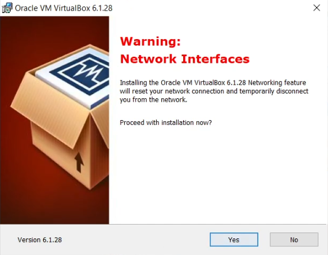
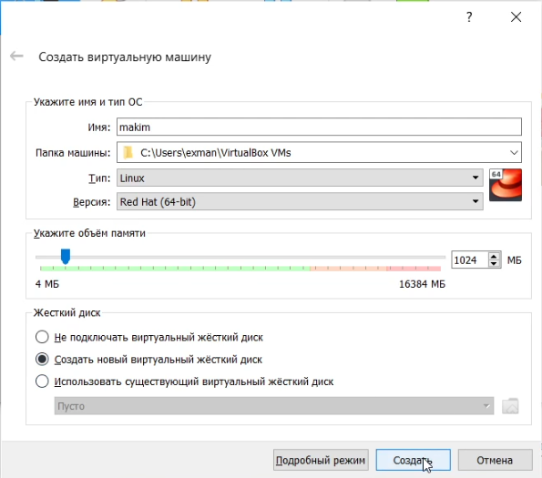
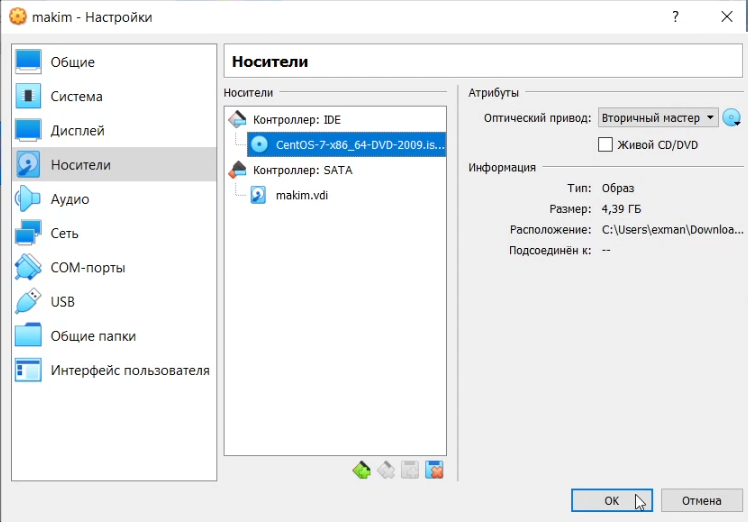
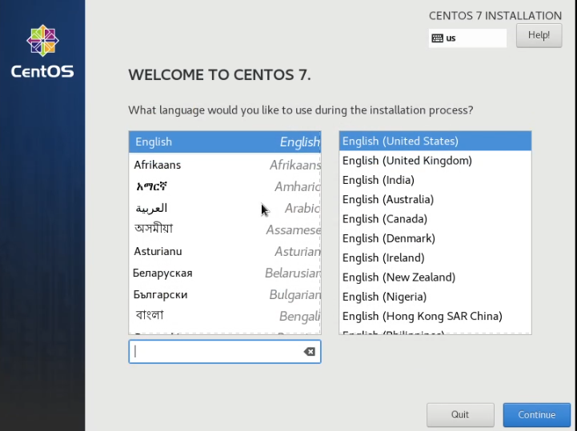
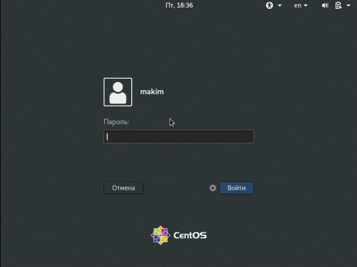
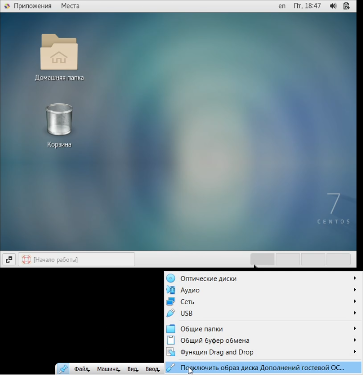

---
# Front matter
title: "Отчет по лабораторной работе №1"
subtitle: "по дисциплине: Операционные системы"
author: "Ким Михаил Алексеевич"

# Generic otions
lang: ru-RU
toc-title: "Содержание"

# Bibliography
bibliography: bib/cite.bib
csl: pandoc/csl/gost-r-7-0-5-2008-numeric.csl

# Pdf output format
toc: true # Table of contents
toc_depth: 2
lof: false # List of figures
lot: false # List of tables
fontsize: 12pt
linestretch: 1.5
papersize: a4
documentclass: scrreprt
## I18n
polyglossia-lang:
  name: russian
  options:
	- spelling=modern
	- babelshorthands=true
polyglossia-otherlangs:
  name: english
### Fonts
mainfont: PT Serif
romanfont: PT Serif
sansfont: PT Sans
monofont: PT Mono
mainfontoptions: Ligatures=TeX
romanfontoptions: Ligatures=TeX
sansfontoptions: Ligatures=TeX,Scale=MatchLowercase
monofontoptions: Scale=MatchLowercase,Scale=0.9
## Biblatex
biblatex: true
biblio-style: "gost-numeric"
biblatexoptions:
  - parentracker=true
  - backend=biber
  - hyperref=auto
  - language=auto
  - autolang=other*
  - citestyle=gost-numeric
## Misc options
indent: true
header-includes:
  - \linepenalty=10 # the penalty added to the badness of each line within a paragraph (no associated penalty node) Increasing the value makes tex try to have fewer lines in the paragraph.
  - \interlinepenalty=0 # value of the penalty (node) added after each line of a paragraph.
  - \hyphenpenalty=50 # the penalty for line breaking at an automatically inserted hyphen
  - \exhyphenpenalty=50 # the penalty for line breaking at an explicit hyphen
  - \binoppenalty=700 # the penalty for breaking a line at a binary operator
  - \relpenalty=500 # the penalty for breaking a line at a relation
  - \clubpenalty=150 # extra penalty for breaking after first line of a paragraph
  - \widowpenalty=150 # extra penalty for breaking before last line of a paragraph
  - \displaywidowpenalty=50 # extra penalty for breaking before last line before a display math
  - \brokenpenalty=100 # extra penalty for page breaking after a hyphenated line
  - \predisplaypenalty=10000 # penalty for breaking before a display
  - \postdisplaypenalty=0 # penalty for breaking after a display
  - \floatingpenalty = 20000 # penalty for splitting an insertion (can only be split footnote in standard LaTeX)
  - \raggedbottom # or \flushbottom
  - \usepackage{float} # keep figures where there are in the text
  - \floatplacement{figure}{H} # keep figures where there are in the text
---

# Цель работы

Приобрести практические навыки установки операционной системы на виртуальную машину, настройки минимально необходимых для дальнейшей работы сервисов.

# Выполнение лабораторной работы

1. Устанавливаем виртуальную машину (рис. 2.1, 2.2):

    

    

2. Создаём новую виртуальную машину. Указываем в имени виртуальной машины логин в дисплейном классе, тип операционной системы — Linux, RedHat. Указываем размер оперативной памяти виртуальной машины — 1024 МБ (рис. 2.3):

    

3. Задаём конфигурацию жёсткого диска — загрузочный, VD (BirtualBox Disk Image), динамический виртуальный диск, размер — 40 ГБ (рис. 2.4):

    

4. Выбираем в VirtualBox /Свойства — Носители/ Вашей виртуальной машины. Добавляем новый привод оптических дисков и выбираем скачанный образ CentOS-7-x86_64-DVD.iso  (рис. 2.5):

    

5. Запускаем виртуальную машину (рис. 2.6):

    

6. Настраиваем операционную систему (рис. 2.7):

    

7.  Входим в ОС под заданной при установке учётной записью (рис. 2.8): 

    

8.  В меню Устройства виртуальной машины подключаем образ диска дополнений гостевой ОС. При необходимости вводим пароль пользователя root вашей виртуальной ОС (рис. 2.9, 2.10):

    

    

# Вывод
Мы приобрели практические навыки по установки ОС, в частности Linux, на виртуальную машину. Научились производить минимальные настройки для дальнейшей работы на ОС. В дополнение к этому, усовершенстовали навыки работы в Терминале, а также разобрали базовые понятия.

# Контрольные вопросы
1. Какую информацию содержит учётная запись пользователя?

    Ответ:

    1. Учетная запись пользователя – это необходимая для системы информация о пользователе, хранящаяся в специальных файлах. Информация используется Linux для аутентификации пользователя и назначения ему прав доступа.
    2. Вся информация о пользователе обычно хранится в файлах /etc/passwd и /etc/group.
    3. /etc/passwd – этот файл содержит информацию о пользователях. В нём содержится следующая информация: имя пользователя, зашифрованный пароль, UID, GID, Настоящее имя пользователя, Домашний каталог, Оболочка.
    4. /etc/group – этот файл содержит информацию о группах, к которым принадлежат пользователи. В нём содержится следующая информация: Имя группы, Шифрованный пароль, GID, Пользователи, включенные в несколько групп.

2. Укажите команды терминала.
    
      Ответ:

      1. Получение справки:
      ```
      help
      ```
      2. Перемещение по файловой системе:
      ```
      cd /<каталог>
      ```
      3. просмотр содержимого каталога:
      ```
      ls
      ```
      4. определение объёма каталога:
      ```
      
      ```
      5. создание / удаление каталогов / файлов:
      ```
      touch <имя файла>
      mkdir <имя каталога>
      rm <имя файла>
      rmdir <имя каталога>
      ```
      6. задание определённых прав на файл / каталог:
      ```
      chmod personsOperatorRights имя_файла_или_имя_директории
      ```
      7. просмотр истории команд:
      ```
      history
      ```

3. Что такое файловая система? Приведите примеры с краткой характеристикой.

      Ответ:
    
      Файловая система – часть операционной системы, обеспечивающая выполнение операций над файлами. 
    
     Файловые системы в Linux используются не только для работы с файлами на диске, но и для хранения данных в оперативной памяти или доступа к конфигурации ядра во время работы системы. Все они включены в ядро и могут использоваться в качестве корневой файловой системы. 

      Ext2, Ext3, Ext4 или Extended Filesystem – стандартная файловая система, первоначально разработанная еще для Minix. Содержит максимальное количество функций и является наиболее стабильной в связи с редкими изменениями кодовой базы. Начиная с ext3 в системе используется функция журналирования. Сегодня версия ext4 присутствует во всех дистрибутивах Linux. 

4. Как посмотреть, какие файловые системы подмонтированы в ОС?

      Ответ:

      В графическом интерфейсе можно определить файловую систему с помощью утилиты Gnome Диски. Программа Gparted тоже предоставляет такую информацию. а также с помощью одной из команд:
      ```
      df -Th | grep "^/dev"
      fsck -N /dev/nvme0n1p6
      lsblk -f
      mount | grep "^/dev"
      sudo file -sL /dev/nvme0n1p6
      ```    
5. Как удалить зависший процесс?

      Ответ:

     PID процесса — это команда pidof, которая принимает в качестве параметра название процесса и выводит его PID. Пример выполнения команды pidof:
    ```
    pidof <имя процесса>
    ```
    Пример PID: 
    ```
    25609
    ```
    Когда известен PID процесса, мы можем убить его командой kill. Команда kill принимает в качестве параметра PID процесса. Например, убьем процесс с номером 25609:
    ```
    kill 25609
    ```
    Команда killall в Linux предназначена для «убийства» всех процессов, имеющих одно и то же имя. Это удобно, так как нам не нужно знать PID процесса. 
    ```
    killall <имя процесса>
    ```