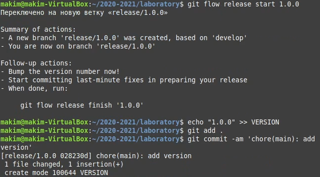
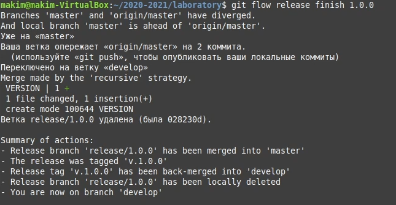
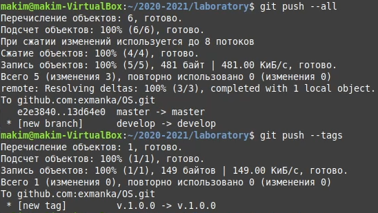

---
# Front matter
lang: ru-RU
title: "Отчет по лабораторной работе №2"
subtitle: "по дисциплине: Операционные системы"
author: "Ким Михаил Алексеевич"

# Formatting
toc-title: "Содержание"
toc: true # Table of contents
toc_depth: 2
lof: false # List of figures
lot: false # List of tables
fontsize: 12pt
linestretch: 1.5
papersize: a4paper
documentclass: scrreprt
polyglossia-lang: russian
polyglossia-otherlangs: english
mainfont: PT Serif
romanfont: PT Serif
sansfont: PT Sans
monofont: PT Mono
mainfontoptions: Ligatures=TeX
romanfontoptions: Ligatures=TeX
sansfontoptions: Ligatures=TeX,Scale=MatchLowercase
monofontoptions: Scale=MatchLowercase
indent: true
pdf-engine: lualatex
header-includes:
  - \linepenalty=10 # the penalty added to the badness of each line within a paragraph (no associated penalty node) Increasing the value makes tex try to have fewer lines in the paragraph.
  - \interlinepenalty=0 # value of the penalty (node) added after each line of a paragraph.
  - \hyphenpenalty=50 # the penalty for line breaking at an automatically inserted hyphen
  - \exhyphenpenalty=50 # the penalty for line breaking at an explicit hyphen
  - \binoppenalty=700 # the penalty for breaking a line at a binary operator
  - \relpenalty=500 # the penalty for breaking a line at a relation
  - \clubpenalty=150 # extra penalty for breaking after first line of a paragraph
  - \widowpenalty=150 # extra penalty for breaking before last line of a paragraph
  - \displaywidowpenalty=50 # extra penalty for breaking before last line before a display math
  - \brokenpenalty=100 # extra penalty for page breaking after a hyphenated line
  - \predisplaypenalty=10000 # penalty for breaking before a display
  - \postdisplaypenalty=0 # penalty for breaking after a display
  - \floatingpenalty = 20000 # penalty for splitting an insertion (can only be split footnote in standard LaTeX)
  - \raggedbottom # or \flushbottom
  - \usepackage{float} # keep figures where there are in the text
  - \floatplacement{figure}{H} # keep figures where there are in the text
---

# Цель работы

Изучить идеологию и применение средств контроля версий.

# Выполнение лабораторной работы

## Настройка git

1. Создаем учётную запись на https://github.com. (рис. 1)


2. Настраиваем систему контроля версий git, как это описано выше c использованием сервера репозиториев https://github.com/:
  
   * Генерируем пару ключей при помощи команды (рис. 2):
    ``` ssh-keygen -C "Mikhail Kim 1032201664@pfur.ru" ```
    

   * Копируем открытый ключ в буфер обмена при помощи команды (рис. 3):
    ``` cat ~/.ssh/id_rsa.pub | xclip -sel clip ```
    

   * Загружаем сгенерированный и скопированный ключ на страницу GitHub'a (рис. 4):
    

3. Создаем структуру каталога лабораторных работ согласно пункту М.2. (рис. 5).


##  Подключение репозитория к github

1. Создаем репозиторий на GitHub. Назовем его OSS. (рис. 6).


2. Рабочий каталог будем обозначать как laboratory. Переходим в этот каталог.
  ``` cd laboratory ```
3. Инициализируем системы git (рис. 7):
  ``` git init ```
4. Создаём заготовку для файла README.md (рис. 7).:
    ```
    echo "# Лабораторные работы" >> README.md
    git add README.md
    ```
5. Делаем первый коммит и выкладываем на github (рис. 7, 8, 9):
    ```
    git commit -m "first commit"
    git remote add origin git@github.com:<username>/sciproc-intro.git
    git push -u origin master
    ```
    
    
    

## Первичная конфигурация

1. Добавляем файл лицензии (рис. 10):
  ``` wget https://creativecommons.org/licenses/by/4.0 legalcode.txt -O LICENSE ```
  
2. Добавляем шаблон игнорируемых файлов. Просмотрим список имеющихся шаблонов (рис. 11):
  ``` curl -L -s https://www.gitignore.io/api/list ```
  
3. Затем скачаем шаблон, например, для C (рис. 12):
  ```curl -L -s https://www.gitignore.io/api/c >> .gitignore ```
  
4. Добавляем новые файлы (рис. 13):
  ``` git add . ```
  
5. Выполним коммит (рис. 14):
  ``` git commit -a ```
6. Отправим на github (рис. 14):
  ``` git push ```
  

## Конфигурация git-flow

1. Инициализируем git-flow. Префикс для ярлыков установим в v. (рис. 15).
  ``` git flow init ```
1. Проверьте, что Вы на ветке develop (рис. 15):
  ``` git branch ```
  
1. Создадим релиз с версией 1.0.0 (рис. 16):
  ``` git flow release start 1.0.0 ```
1. Запишем версию (рис. 16):
  ``` echo "1.0.0" >> VERSION ```
1. Добавим в индекс (рис. 16):
  ``` git add . ```
  ``` git commit -am 'chore(main): add version' ```
  
1. Зальём релизную ветку в основную ветку (рис. 17):
  ``` git flow release finish 1.0.0 ```
  
1. Отправим данные на github (рис. 18):
  ``` git push --all ```
  ``` git push --tags ```
  
1. Создадим релиз на github (рис. 19):
  

# Выводы

В ходу выполнения данной лабораторной работы я изучил основы применения средств контроля версий, основы использования сайти GitHub, а также разобрался в некоторых элементах работы с git-flow.
