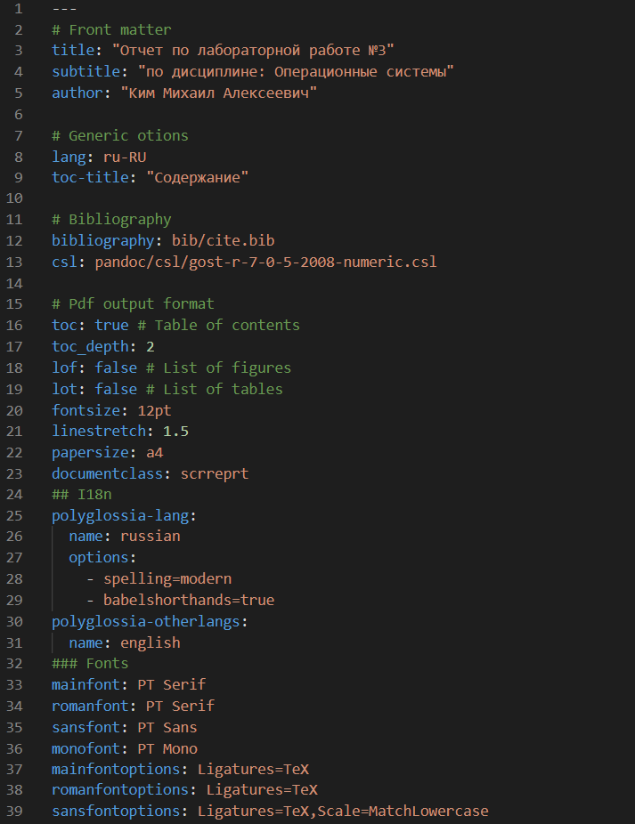
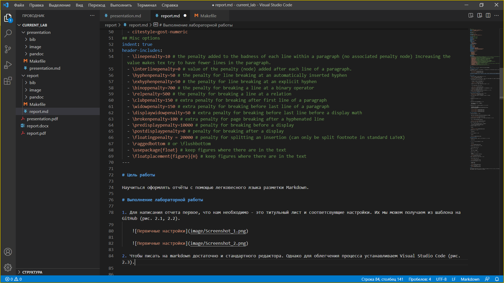
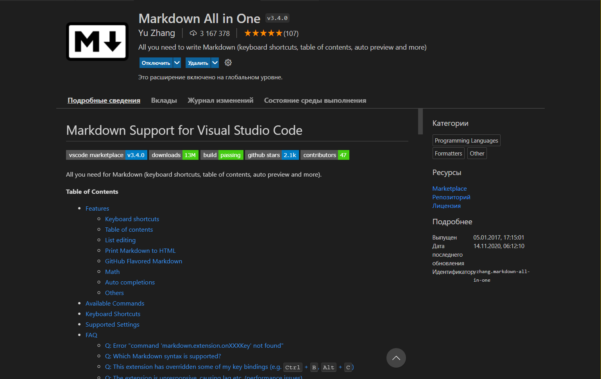
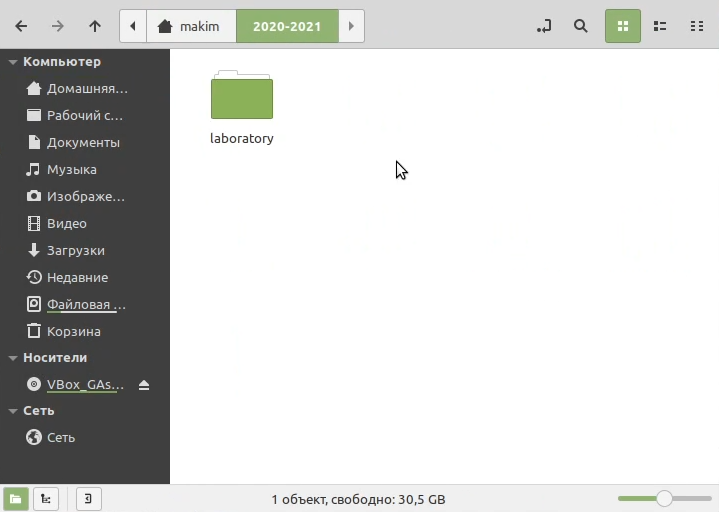
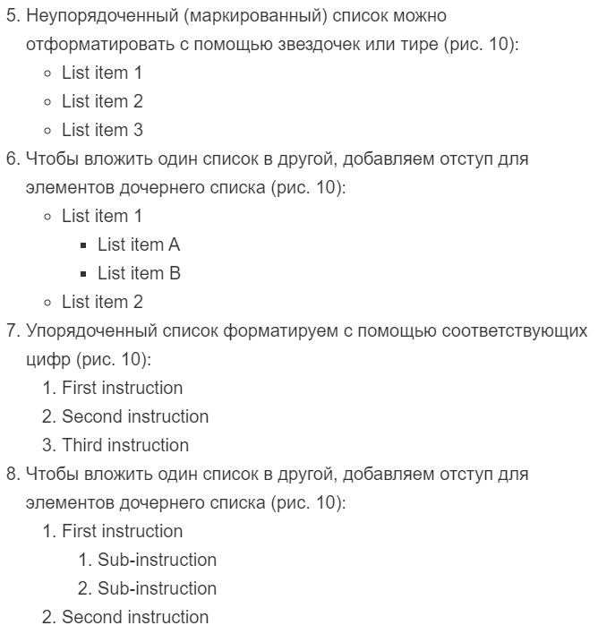
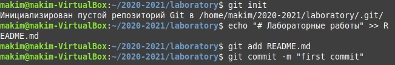
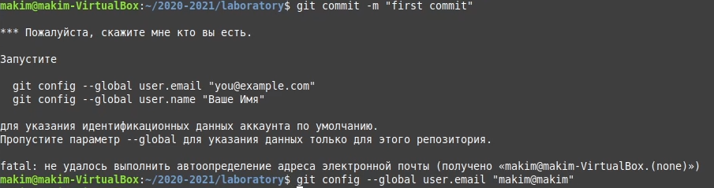
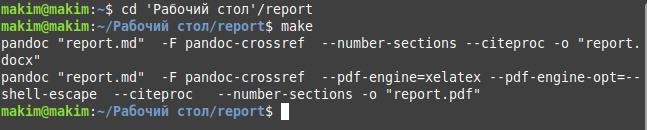

---
# Front matter
title: "Отчет по лабораторной работе №3"
subtitle: "по дисциплине: Операционные системы"
author: "Ким Михаил Алексеевич"

# Generic otions
lang: ru-RU
toc-title: "Содержание"

# Bibliography
bibliography: bib/cite.bib
csl: pandoc/csl/gost-r-7-0-5-2008-numeric.csl

# Pdf output format
toc: true # Table of contents
toc_depth: 2
lof: false # List of figures
lot: false # List of tables
fontsize: 12pt
linestretch: 1.5
papersize: a4
documentclass: scrreprt
## I18n
polyglossia-lang:
  name: russian
  options:
	- spelling=modern
	- babelshorthands=true
polyglossia-otherlangs:
  name: english
### Fonts
mainfont: PT Serif
romanfont: PT Serif
sansfont: PT Sans
monofont: PT Mono
mainfontoptions: Ligatures=TeX
romanfontoptions: Ligatures=TeX
sansfontoptions: Ligatures=TeX,Scale=MatchLowercase
monofontoptions: Scale=MatchLowercase,Scale=0.9
## Biblatex
biblatex: true
biblio-style: "gost-numeric"
biblatexoptions:
  - parentracker=true
  - backend=biber
  - hyperref=auto
  - language=auto
  - autolang=other*
  - citestyle=gost-numeric
## Misc options
indent: true
header-includes:
  - \linepenalty=10 # the penalty added to the badness of each line within a paragraph (no associated penalty node) Increasing the value makes tex try to have fewer lines in the paragraph.
  - \interlinepenalty=0 # value of the penalty (node) added after each line of a paragraph.
  - \hyphenpenalty=50 # the penalty for line breaking at an automatically inserted hyphen
  - \exhyphenpenalty=50 # the penalty for line breaking at an explicit hyphen
  - \binoppenalty=700 # the penalty for breaking a line at a binary operator
  - \relpenalty=500 # the penalty for breaking a line at a relation
  - \clubpenalty=150 # extra penalty for breaking after first line of a paragraph
  - \widowpenalty=150 # extra penalty for breaking before last line of a paragraph
  - \displaywidowpenalty=50 # extra penalty for breaking before last line before a display math
  - \brokenpenalty=100 # extra penalty for page breaking after a hyphenated line
  - \predisplaypenalty=10000 # penalty for breaking before a display
  - \postdisplaypenalty=0 # penalty for breaking after a display
  - \floatingpenalty = 20000 # penalty for splitting an insertion (can only be split footnote in standard LaTeX)
  - \raggedbottom # or \flushbottom
  - \usepackage{float} # keep figures where there are in the text
  - \floatplacement{figure}{H} # keep figures where there are in the text
---

# Цель работы

Научиться оформлять отчёты с помощью легковесного языка разметки Markdown.

# Выполнение лабораторной работы

1. Для написания отчета первое, что нам необходимо - это титульный лист и соответсвующие настройки. Их мы можем получаем из шаблона на GitHub (рис. 2.1, 2.2).

    

    

2. Чтобы писать на markdown достаточно и стандартного редактора. Однако для облегчения процесса устанавливаем Visual Studio Code (рис. 2.3).

    

3. Также для облегчения работы устанавливаем дополнительные опции, к примеру, Markdown All In One. Как ясно из названия, расширение позволяет максимально расширить функционал VSC. Крайне полезной опцией оказалась возможность просмотра результирующего файла в реальном времени (рис. 2.4):

    

4. Создание заголовка происходит следующим образом (рис. 2.5):

    ```
    # This is heading 1
    ## This is heading 2
    ### This is heading 3
    #### This is heading 4
    ```

    

5. Неупорядоченный (маркированный) список можно отформатировать с помощью звездочек или тире (рис. 2.6):

    ```
    - List item 1
    - List item 2
    - List item 3
    ```

6. Чтобы вложить один список в другой, добавляем отступ для элементов дочернего списка (рис. 2.6):

    ```
    - List item 1
    - List item A
    - List item B
    - List item 2
    ```

7. Упорядоченный список форматируем с помощью соответствующих цифр (рис. 2.6):

    ```
    1. First instruction
    1. Second instruction
    1. Third instruction
    ```

8. Чтобы вложить один список в другой, добавляем отступ для элементов дочернего списка (рис. 2.6):

    ```
    1. First instruction
    1. Sub-instruction
    1. Sub-instruction
    1. Second instruction
    ```

    

9. Для того чтобы оградить какой-то код используем конструкцию (```) (рис. 2.7):

    ```
    language your code goes in here
    ```

    

10. Ознакомившись с базовыми конструкциями, мы переходим к написанию отчета. 

11. После того как мы закончили написание отчета, нам необходимо обработать файл в формате Markdown.

12. Для обработки файлов в формате Markdown устанавливаем Pandoc https://pandoc.org/. Конкретно, нам понадобится программа pandoc, pandoc-citeproc https://github.com/jgm/pandoc/releases, pandoc-crossref https://github.com/lierdakil/pandoc-crossref/releases (рис. 2.8):

    

13. Преобразовываем файл report.md в PDf и docx следующим образом:

    ```
    pandoc report.md -o report.pdf
    pandoc README.md -o README.docx
    ```

14. Также можно использовать Makefile (рис. 2.9):

    ```
    FILES = $(patsubst %.md, %.docx, $(wildcard *.md))
    FILES += $(patsubst %.md, %.pdf, $(wildcard *.md))
    LATEX_FORMAT =
    FILTER = --filter pandoc-crossref
    %.docx: %.md
        -pandoc "$<" $(FILTER) -o "$@"
    %.pdf: %.md
        -pandoc "$<" $(LATEX_FORMAT) $(FILTER) -o "$@"
    all: $(FILES)
        @echo $(FILES)
    clean:
        -rm $(FILES) *~
    ```

    

15. Последним пунктом хотелось бы отметить, что на моей системе презентация, составленная по шаблону, предоставленному на GitHub, не «собирается» в pdf из-за ошибки (рис. 2.10). Поэтому решено было использовать обновленный шаблон для отчета. Надеюсь, на оценивание презентации это никак не сможет повлиять.

    


# Выводы
Мы научились оформлять отчёты с помощью легковесного языка разметки Markdown, изучили его базовые конструкции, создали удобную среду для написания отчета, а также научились форматировать файл md в форматы pdf, docx.