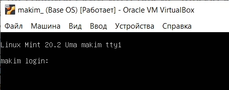
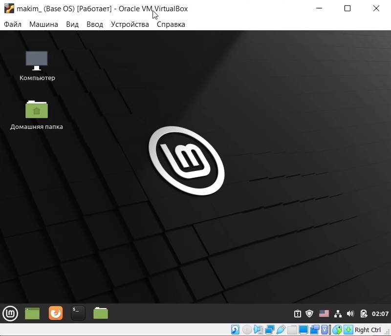
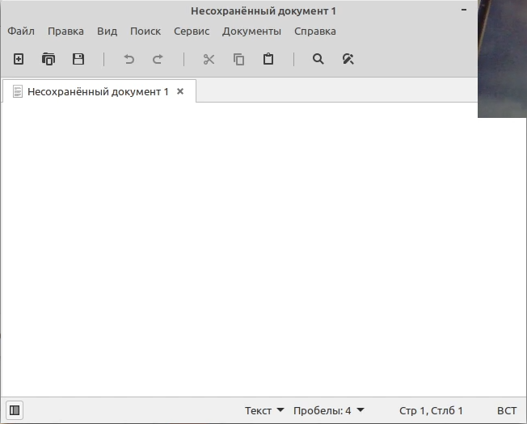
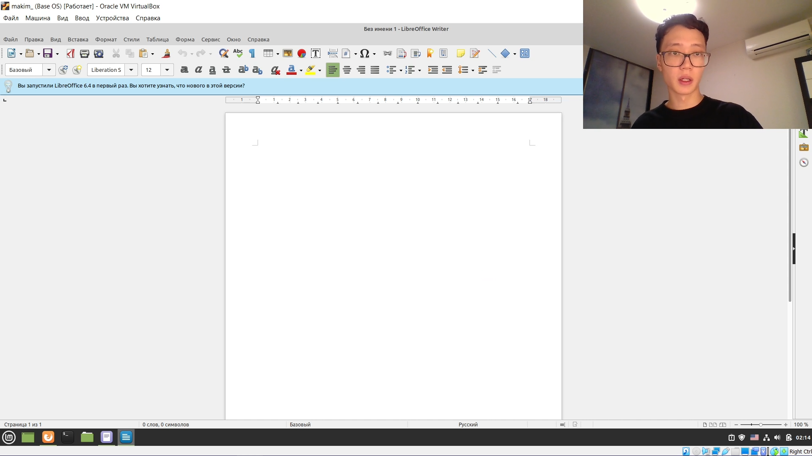
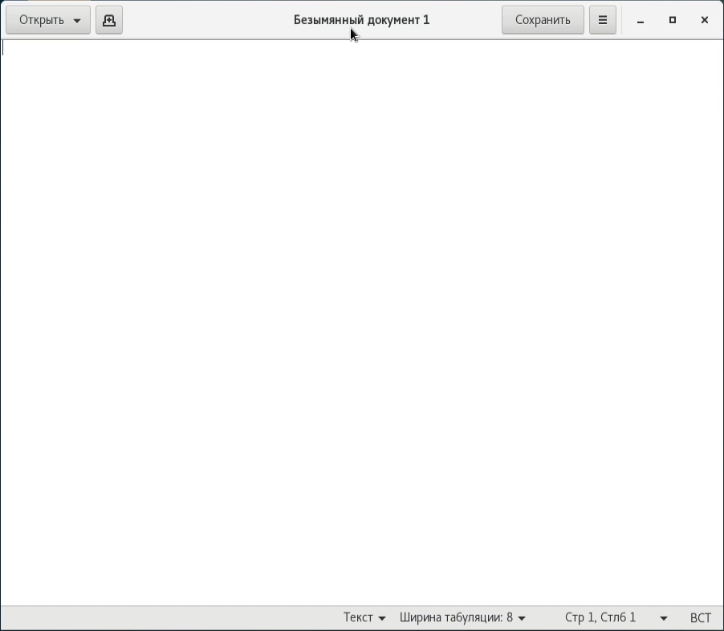
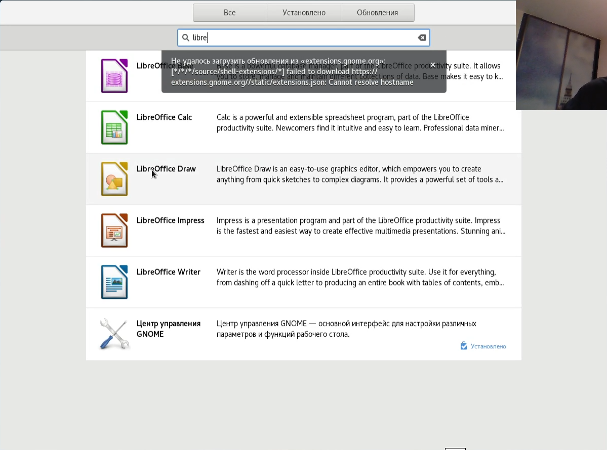

---
# Front matter
title: "Отчет по лабораторной работе №4"
subtitle: "по дисциплине: Операционные системы"
author: "Ким Михаил Алексеевич"

# Generic otions
lang: ru-RU
toc-title: "Содержание"

# Bibliography
bibliography: bib/cite.bib
csl: pandoc/csl/gost-r-7-0-5-2008-numeric.csl

# Pdf output format
toc: true # Table of contents
toc_depth: 2
lof: false # List of figures
lot: false # List of tables
fontsize: 12pt
linestretch: 1.5
papersize: a4
documentclass: scrreprt
## I18n
polyglossia-lang:
  name: russian
  options:
	- spelling=modern
	- babelshorthands=true
polyglossia-otherlangs:
  name: english
### Fonts
mainfont: PT Serif
romanfont: PT Serif
sansfont: PT Sans
monofont: PT Mono
mainfontoptions: Ligatures=TeX
romanfontoptions: Ligatures=TeX
sansfontoptions: Ligatures=TeX,Scale=MatchLowercase
monofontoptions: Scale=MatchLowercase,Scale=0.9
## Biblatex
biblatex: true
biblio-style: "gost-numeric"
biblatexoptions:
  - parentracker=true
  - backend=biber
  - hyperref=auto
  - language=auto
  - autolang=other*
  - citestyle=gost-numeric
## Misc options
indent: true
header-includes:
  - \linepenalty=10 # the penalty added to the badness of each line within a paragraph (no associated penalty node) Increasing the value makes tex try to have fewer lines in the paragraph.
  - \interlinepenalty=0 # value of the penalty (node) added after each line of a paragraph.
  - \hyphenpenalty=50 # the penalty for line breaking at an automatically inserted hyphen
  - \exhyphenpenalty=50 # the penalty for line breaking at an explicit hyphen
  - \binoppenalty=700 # the penalty for breaking a line at a binary operator
  - \relpenalty=500 # the penalty for breaking a line at a relation
  - \clubpenalty=150 # extra penalty for breaking after first line of a paragraph
  - \widowpenalty=150 # extra penalty for breaking before last line of a paragraph
  - \displaywidowpenalty=50 # extra penalty for breaking before last line before a display math
  - \brokenpenalty=100 # extra penalty for page breaking after a hyphenated line
  - \predisplaypenalty=10000 # penalty for breaking before a display
  - \postdisplaypenalty=0 # penalty for breaking after a display
  - \floatingpenalty = 20000 # penalty for splitting an insertion (can only be split footnote in standard LaTeX)
  - \raggedbottom # or \flushbottom
  - \usepackage{float} # keep figures where there are in the text
  - \floatplacement{figure}{H} # keep figures where there are in the text
---

# Цель работы

Ознакомиться с операционной системой Linux, получить практические навыки работы с консолью и некоторыми графическими менеджерами рабочих столов операционной
системы.

# Выполнение лабораторной работы

1. Переходим на текстовую консоль. На моём устройстве доступно 6 консолей. Перейти в них можно с помощью сочетания клавиш (рис. 2.1, рис. 2.2):

    ```
    Ctrl + Alt + F1...F6
    ``` 

    

    

1. Регистрируемся в текстовой консоли операционной системы. Для этого используем логин и пароль для входа в свою учетную запись. При написании пароля символы не оторажаются (рис. 2). (рис. 2.3):

    

1. Завершаем консольный сеанс с помощью сочетания клавиш (рис. 2.4):

    ```
    Ctrl + D
    ```  

    

1. Переключаемся на графический интерфейс (рис. 2.5):

    ```
    Ctrl + Alt + F7
    ``` 

    

1. Завершаем сеанс и знакомимся с другими графическими интерфейсами. Так как я выполняю лабораторную работу не в дисплейных классах, у меня нет возможности ознакомиться с менеджером рабочих столов. Однако в VirtualBox у меня установлены две виртуальные машины с разными дистрибутивами Linux с отличающимися GUI, поэтому я могу продемонстрировать их функционал (рис. 2.6):

    

    

    

    

    

    

    

    

# Выводы
Мы познакомились с операционной системой Linux, получили практические навыки работы с текстовой консолью и некоторыми графическими менеджерами рабочих столов операционной системы, в частности изучили их работу и нашли отличия.

# Контрольные вопросы

1. Что такое компьютерный терминал? Есть ли, по вашему мнению, у него преимущества перед графическим интерфейсом?

Компьютерный терминал — устройство ввода–вывода, основные функции которого заключаются в вводе и отображении данных.Ввод команд в терминале, оказывается гораздо быстрее на практике и представляет намного больше возможностей. Бывает, случается так что работа в консоли остается единственным способом доступа в систему и единственным способом устранить появившуюся вдруг неполадку. 

2. Что такое входное имя пользователя?

Входное имя пользователя (Login) — название учётной записи пользователя.

3. В каком файле хранятся пароли пользователей? В каком виде они хранятся?

Из соображений безопасности все пароли были перенесены в специальный файл /etc/shadow, недоступный для чтения обычным пользователям. Поэтому в файле /etc/passwd поле password имеет значение x

4. Где хранятся настройки пользовательских программ?

Настройки программ в основном лежат в конкретном месте, в папке пользователя ~/.config/ (/home/USER/.config/).

5. Какое входное имя у администратора ОС Unix?

Пользователь root имеет права администратора и может выполнять любые действия в системе. 

6. Имеет ли администратор доступ к настройкам пользователей?

Да. Права ***root*** ничем не ограничены и он является царем и богом на компьютере.

7. Каковы основные характеристики многопользовательской модели разграничения доступа?

Если имя пользователя, обращающегося к файлу, не совпадает с именем владельца, то система проверяет, принадлежит ли владелец к группе, которая сопоставлена данному файлу (будем просто называть ее группой файла). Если принадлежит, то для определения возможности доступа к файлу используются атрибуты, относящиеся к группе, а на атрибуты для владельца и всех остальных пользователей внимания не обращается. Если же пользователь не является владельцем файла и не входит в группу файла, то его права определяются атрибутами для остальных пользователей. Таким образом, третья группа атрибутов, определяющих права доступа к файлу, относится ко всем пользователям, кроме владельца файла и пользователей, входящих в группу файла.

Например:
```
[user]$ ls -l /bin/ls
-rwxr-xr-x 1 root root 49940 Sep 12 1999 /bin/ls
```
Видим, что в начале следуют три группы по три символа, которые и определяют права доступа к файлу соответственно

8. Какую информацию кроме пароля и логина содержит учётная запись пользователя?

Учётная запись пользователя содержит:
– входное имя пользователя (Login Name);
– пароль (Password);
– внутренний идентификатор пользователя (User ID);
– идентификатор группы (Group ID);
– анкетные данные пользователя (General Information);
– домашний каталог (Home Dir);
– указатель на программную оболочку (Shell).

9. Что такое UID и GID? Расшифруйте эти аббревиатуры.

Входному имени пользователя ставится в соответствие внутренний идентификатор пользователя в системе (User ID, UID) — положительное целое число в диапазоне от 0 до 65535, по которому в системе однозначно отслеживаются действия пользователя.

Пользователю может быть назначена определенная группа для доступа к некоторым ресурсам, разграничения прав доступа к различным файлам и директориям. Каждая группа пользователей в операционной системе имеет свой идентификатор — Group ID (GID).

10. Что такое GECOS?

Анкетные данные пользователя (General Information или GECOS) являются необязательным параметром учётной записи и могут содержать реальное имя пользователя (фамилию, имя), адрес, телефон.

11. Что такое домашний каталог? Какие файлы хранятся в нем?

В домашнем каталоге пользователя хранятся данные (файлы) пользователя, настройки рабочего стола и других приложений. Содержимое домашнего каталога обычно не доступно другим пользователям с обычными правами и не влияет на работу и настройки рабочей среды других пользователей.

12. Как называется ваш домашний каталог?
```
/home/aviljin
```
13. Имеет ли администратор возможность изменить содержимое домашнего каталога пользователя?

Да. Пользователь root имеет права администратора и может выполнять любые действия в системе.

14. Что хранится в файле /etc/passwd?

Учётные записи пользователей хранятся в файле /etc/passwd, который имеет следующую структуру:
```
login:password:UID:GID:GECOS:home:shell 
```

15. Как, просмотрев содержимое файла /etc/passwd, узнать, какие пользователи не смогут войти в систему?

Символ * в поле password некоторой учётной записи в файле /etc/passwd означает, что пользователь не сможет войти в систему.

16. Что такое виртуальные консоли?

Виртуальные консоли — реализация концепции многотерминальной работы в рамках одного устройства.

17. Зачем нужна программа getty?

Программа для UNIX-подобных операционных систем, управляющая доступом к физическим и виртуальным терминалам (tty). Программа выполняет запрос имени пользователя и запускает программу 'login' для авторизации пользователя.

18. Что такое сеанс работы?

Весь процесс взаимодействия пользователя с системой с момента регистрации до выхода называется сеансом работы

19. Что такое тулкит?

Toolkit (Tk, «набор инструментов», «инструментарий»)— кроссплатформенная библиотека базовых элементов графического интерфейса, распространяемая с открытыми исходными текстами

20. Какие основные тулкиты существуют в системе Unix?

Используются следующие основные тулкиты:
1. GTK+ (сокращение от GIMP Toolkit) — кроссплатформенная библиотека элементов интерфейса;
2. Qt — кросс-платформенный инструментарий разработки программного обеспечения на языке программирования C++. GTK+ состоит из двух компонентов:
3. GTK — содержит набор элементов пользовательского интерфейса (таких, как кнопка, список, поле для ввода текста и т. п.) для различных задач;
4.  GDK — отвечает за вывод информации на экран, может использовать для этого X Window System, Linux Framebuffer, WinAPI.