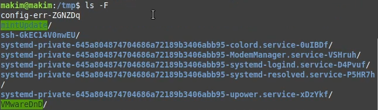
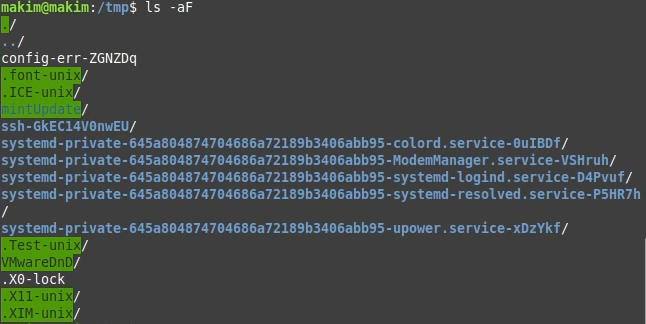
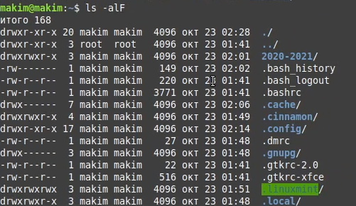
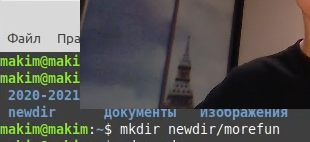
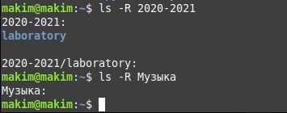
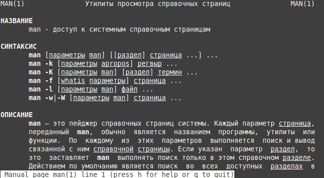
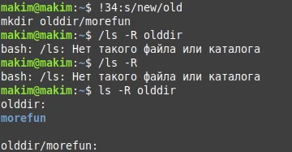
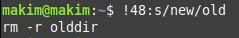

---
# Front matter
title: "Отчет по лабораторной работе №5"
subtitle: "по дисциплине: Операционные системы"
author: "Ким Михаил Алексеевич"

# Generic otions
lang: ru-RU
toc-title: "Содержание"

# Bibliography
bibliography: bib/cite.bib
csl: pandoc/csl/gost-r-7-0-5-2008-numeric.csl

# Pdf output format
toc: true # Table of contents
toc_depth: 2
lof: false # List of figures
lot: false # List of tables
fontsize: 12pt
linestretch: 1.5
papersize: a4
documentclass: scrreprt
## I18n
polyglossia-lang:
  name: russian
  options:
	- spelling=modern
	- babelshorthands=true
polyglossia-otherlangs:
  name: english
### Fonts
mainfont: PT Serif
romanfont: PT Serif
sansfont: PT Sans
monofont: PT Mono
mainfontoptions: Ligatures=TeX
romanfontoptions: Ligatures=TeX
sansfontoptions: Ligatures=TeX,Scale=MatchLowercase
monofontoptions: Scale=MatchLowercase,Scale=0.9
## Biblatex
biblatex: true
biblio-style: "gost-numeric"
biblatexoptions:
  - parentracker=true
  - backend=biber
  - hyperref=auto
  - language=auto
  - autolang=other*
  - citestyle=gost-numeric
## Misc options
indent: true
header-includes:
  - \linepenalty=10 # the penalty added to the badness of each line within a paragraph (no associated penalty node) Increasing the value makes tex try to have fewer lines in the paragraph.
  - \interlinepenalty=0 # value of the penalty (node) added after each line of a paragraph.
  - \hyphenpenalty=50 # the penalty for line breaking at an automatically inserted hyphen
  - \exhyphenpenalty=50 # the penalty for line breaking at an explicit hyphen
  - \binoppenalty=700 # the penalty for breaking a line at a binary operator
  - \relpenalty=500 # the penalty for breaking a line at a relation
  - \clubpenalty=150 # extra penalty for breaking after first line of a paragraph
  - \widowpenalty=150 # extra penalty for breaking before last line of a paragraph
  - \displaywidowpenalty=50 # extra penalty for breaking before last line before a display math
  - \brokenpenalty=100 # extra penalty for page breaking after a hyphenated line
  - \predisplaypenalty=10000 # penalty for breaking before a display
  - \postdisplaypenalty=0 # penalty for breaking after a display
  - \floatingpenalty = 20000 # penalty for splitting an insertion (can only be split footnote in standard LaTeX)
  - \raggedbottom # or \flushbottom
  - \usepackage{float} # keep figures where there are in the text
  - \floatplacement{figure}{H} # keep figures where there are in the text
---

# Цель работы

Приобретение практических навыков взаимодействия пользователя с системой посредством командной строки.

# Выполнение лабораторной работы

1. Определим полное имя домашнего каталога (рис. 2.1)

    ```
    pwd
    ```

    

2. Переходим в каталог /tmp. Выведите на экран содержимое каталога /tmp. Для этого используем команду ls с различными опциями (-a, -F, -l). Для того, чтобы отобразить имена скрытых файлов, необходимо использовать команду ls с опцией a. Получаем  информацию о типах файлов (каталог, исполняемый файл, ссылка) с помощью опции F. Опция -l выведет подробную информацию о файлах и каталогах (рис. 2.2 - 2.7):

    ```
    cd /tmp
    ls -a
    ls -l
    ls -F
    ls -alF
    ```

    

    

    

    

    

    

3. Определим, есть ли в каталоге /var/spool подкаталог с именем cron. Видим, что подкаталог cron существует (рис. 2.8)

    ```
    ls /var/spool
    ```

    

4. Перейдём в домашний каталог и выведем на экран его содержимое. Определим, кто является владельцем файлов и подкаталогов, ориентируясь на столбик – владелец. (рис. 2.9)

    ```
    ls -l
    или
    ls -alF
    ```

    

5. В домашнем каталоге создадим новый каталог с именем newdir (рис. 2.10)

    ```
    mkdir newdir
    ```

6. В каталоге ~/newdir создадим новый каталог с именем morefun (рис. 2.10)

    ```
    mkdir newdir/morefun
    ```

    

7. В домашнем каталоге создадим одной командой три новых каталога с именами letters, memos, misk (рис. 2.11):

    ```
    mkdir letters memos misk
    ```

    

8. Удалим каталог ~/newdir/morefun из домашнего каталога. Проверим, был ли каталог удалён (рис. 2.12):

    ```
    rm -r newdir
    ```

    

9. С помощью команды man определим, какую опцию команды ls нужно использовать для просмотра содержимого не только указанного каталога, но и подкаталогов, входящих в него. Находим опцию -R (рис. 2.13, 2.14):

    ```
    man ls
    ls -R 2020-2021
    ls -R Музыка
    ```

    

    

10. С помощью команды man определим набор опций команды ls, позволяющий отсортировать по времени последнего изменения выводимый список содержимого каталога с развёрнутым описанием файлов. В открывшемся окне находим, что для сортировки подходит опция -u вместе с -lt (рис. 2.15):

    ```
    ls -u -lt
    ```

    

11. Используем команду man для просмотра описания следующих команд: man, cd, pwd, mkdir, rmdir, rm (рис 2.16-2.21):

    

    

    

    

    

    

12. Используя информацию, полученную при помощи команды history, выполним модификацию и исполнение нескольких команд из буфера команд (рис. 2.26 - 2.28)

    ```
    history
    !32:s/new/old
    !34:s/new/old
    !48:s/new/old
    ```

    

    

    

    

# Выводы

Приобретены практические навыкы взаимодействия пользователя с системой посредством командной строки. Изучены новые команды и их опции. улучшено понимание работы Linux.

# Термины

* КОРЕНЬ. Это главный каталог в системе Linux. По сути, это и есть файловая система Linux. Здесь нет дисков или чего-то подобного, как в Windows. Вместо этого, адреса всех файлов начинаются с корня, а дополнительные разделы, флешки или оптические диски подключаются в папки корневого каталога.

* Каталог, он же директория, (от англисйкого Directory) – это объект в ФС (файловой системе), необходимый для того, чтобы упросить работу с файлами.

* Домашний каталог - каталог, предназначенный для хранения собственных данных пользователя Linux. Как правило, является текущим непосредственно после регистрации пользователя в системе.

* Команда - записанный по специальным правилам текст (возможно с аргументами), представляющий собой указание на выполнение какой-либо функций (или действий) в операционной системе.

* Символическая ссылка — это файл, который связывается с другим файлом или директорией используя путь (адрес места расположения) последнего.