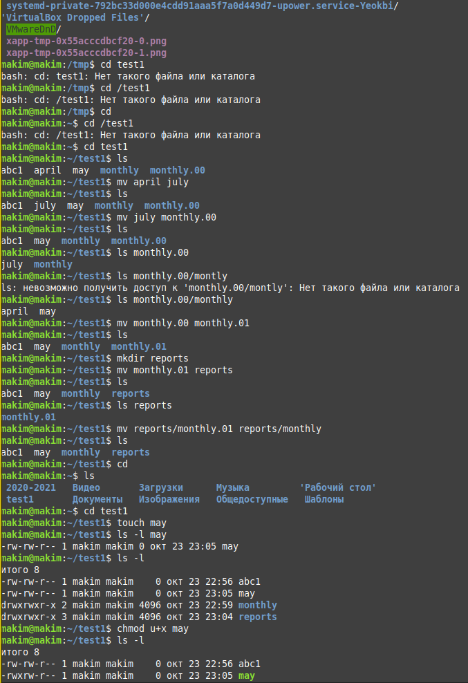
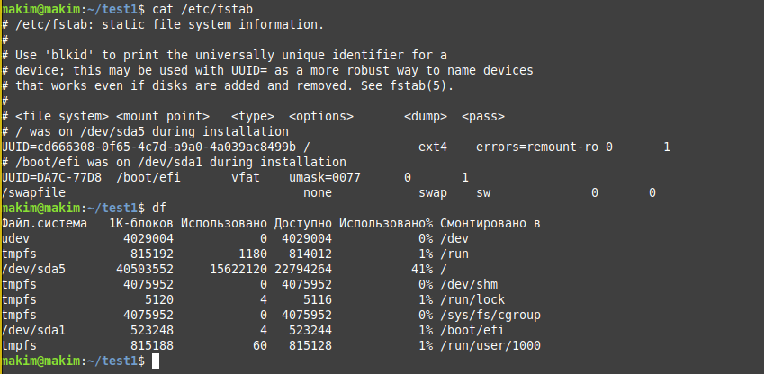
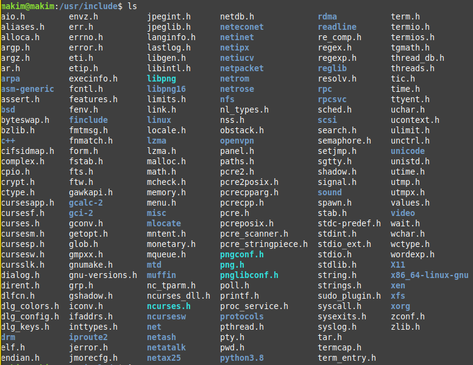
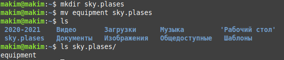
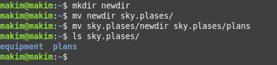
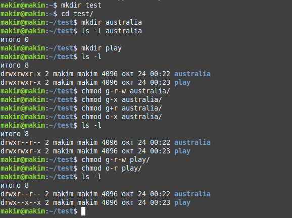
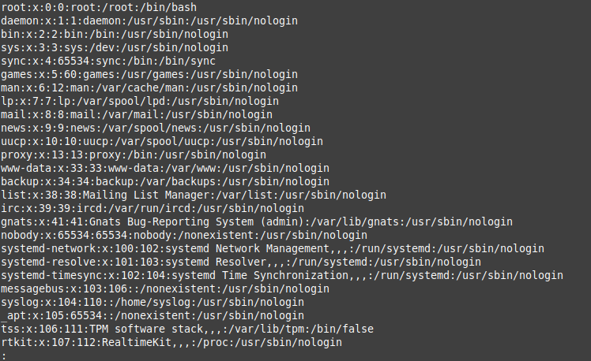
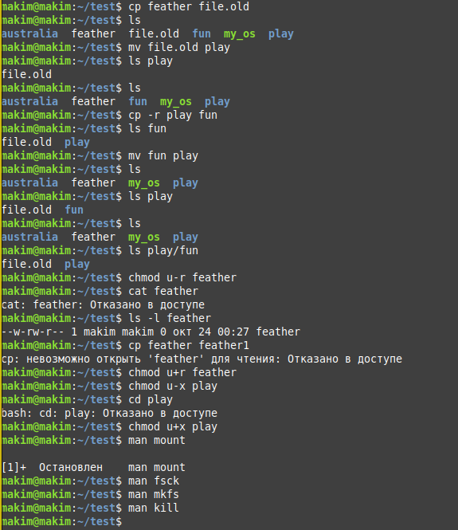

---
# Front matter
title: "Отчет по лабораторной работе №6"
subtitle: "по дисциплине: Операционные системы"
author: "Ким Михаил Алексеевич"

# Generic otions
lang: ru-RU
toc-title: "Содержание"

# Bibliography
bibliography: bib/cite.bib
csl: pandoc/csl/gost-r-7-0-5-2008-numeric.csl

# Pdf output format
toc: true # Table of contents
toc_depth: 2
lof: false # List of figures
lot: false # List of tables
fontsize: 12pt
linestretch: 1.5
papersize: a4
documentclass: scrreprt
## I18n
polyglossia-lang:
  name: russian
  options:
	- spelling=modern
	- babelshorthands=true
polyglossia-otherlangs:
  name: english
### Fonts
mainfont: PT Serif
romanfont: PT Serif
sansfont: PT Sans
monofont: PT Mono
mainfontoptions: Ligatures=TeX
romanfontoptions: Ligatures=TeX
sansfontoptions: Ligatures=TeX,Scale=MatchLowercase
monofontoptions: Scale=MatchLowercase,Scale=0.9
## Biblatex
biblatex: true
biblio-style: "gost-numeric"
biblatexoptions:
  - parentracker=true
  - backend=biber
  - hyperref=auto
  - language=auto
  - autolang=other*
  - citestyle=gost-numeric
## Misc options
indent: true
header-includes:
  - \linepenalty=10 # the penalty added to the badness of each line within a paragraph (no associated penalty node) Increasing the value makes tex try to have fewer lines in the paragraph.
  - \interlinepenalty=0 # value of the penalty (node) added after each line of a paragraph.
  - \hyphenpenalty=50 # the penalty for line breaking at an automatically inserted hyphen
  - \exhyphenpenalty=50 # the penalty for line breaking at an explicit hyphen
  - \binoppenalty=700 # the penalty for breaking a line at a binary operator
  - \relpenalty=500 # the penalty for breaking a line at a relation
  - \clubpenalty=150 # extra penalty for breaking after first line of a paragraph
  - \widowpenalty=150 # extra penalty for breaking before last line of a paragraph
  - \displaywidowpenalty=50 # extra penalty for breaking before last line before a display math
  - \brokenpenalty=100 # extra penalty for page breaking after a hyphenated line
  - \predisplaypenalty=10000 # penalty for breaking before a display
  - \postdisplaypenalty=0 # penalty for breaking after a display
  - \floatingpenalty = 20000 # penalty for splitting an insertion (can only be split footnote in standard LaTeX)
  - \raggedbottom # or \flushbottom
  - \usepackage{float} # keep figures where there are in the text
  - \floatplacement{figure}{H} # keep figures where there are in the text
---

# Цель работы

Ознакомление с файловой системой Linux, её структурой, именами и содержанием каталогов. Приобретение практических навыков по применению команд для работы с файлами и каталогами, по управлению процессами (и работами), по проверке использования диска и обслуживанию файловой системы.

# Выполнение лабораторной работы

1. Выполните все примеры, приведённые в первой части описания лабораторной работы (рис. 2.1-2.6)

    

    

    

    

    

    

2. Скопируем файл /usr/include/aio.h в домашний каталог и назовём его equipment. (рис. 2.7)

    ```
    cp /ust/include/aio.h
    mv aio.h equipment
    ```

    

3. В домашнем каталоге создаём директорию ~/sky.plases. (рис. 2.8)

    ```
    mkdir ski.plases
    ```

4. Перемещаем файл equipment в каталог ~/sky.plases. (рис. 2.8)

    ```
    mv equipment sky.plases
    ```

    

5. Переименовываем файл ~/sky.plases/equipment в ~/sky.plases/equiplist. (рис. 2.9)

    ```
    mv sky.plases/equipment sky.plases/equiplist 
    ```

6. Создаём в домашнем каталоге файл abc1 и перемещаем его в каталог ~/sky.plases, называем его equiplist2. (рис. 2.9)

    ```
    touch abc1
    mv abc1 sky.plases
    mv sky.plases/abc1 sky.plases/equiplist2
    ```

    

7. Создаём каталог с именем equipment в каталоге ~/sky.plases.(рис. 2.10)

    ```
    mkdir sky.plases/equipment
    ```

8. Перемещаем файлы ~/sky.plases/equiplist и equiplist2 в каталог ~/sky.plases/equipment.(рис. 2.10)

    ```
    mv sky.plases/equiplist sky.plases/equiplist2 sky.plases/equipment
    ```

    

9. Создаём и перемещаем каталог ~/newdir в каталог ~/sky.plases и называем его plans.(рис. 2.11)

    ```
    mkdir newdir
    mv newdir sky.plases
    mv sky.plases/newdir sky.plases/plans
    ```

    

10. Определяем опции команды chmod, необходимые для того, чтобы присвоить перечисленным ниже файлам выделенные права доступа, считая, что в начале таких прав нет: drwxr--r-- ... australia, drwx--x--x ... play, -r-xr--r-- ... my_os, -rw-rw-r-- ... feathers. (рис. 2.12, 2.13)

    ```
    mkdir australia
    ls -l
    chmod g-x australia
    chmod g-x australia
    chmod o-x australia

    mkdir play
    ls -l
    chmod g-r-w play
    chmod o-r play

    touch my_os
    ls -l
    chmod u-w+x,g-w my_os

    touch feathers
    ls -l
    ```

    

    
    

11. Просматриваем содержимое файла /etc/passwd. Файла etc/password не существует. (рис. 2.14 - 2.17)

    ```
    cd /etc
    cat passwd
    ```

    

    

    

    

12. Скопируем файл ~/feather в файл ~/file.old.(рис. 2.18)

    ```
    cp feather file.old
    ```

13. Переместим файл ~/file.old в каталог ~/play.(рис. 2.18)

    ```
    mv file.old play
    ```

14. Скопируем каталог ~/play в каталог ~/fun.(рис. 2.18)

    ```
    cp -r play fun
    ```

15. Переместим каталог ~/fun в каталог ~/play.(рис. 2.18)

    ```
    mv fun play
    ```

16. Лишаем владельца файла ~/feather права на чтение. При попытке просмотра файла или его копирование появляется ошибка "Отказано в доступе". (рис. 2.18)

    ```
    chmod u-r feather
    cat feather
    cp feather feather1
    ```

17. Даём владельцу файла ~/feather право на чтение. (рис. 2.18)

    ```
    chmod u+r feathers
    ```

18. Лишаем владельца каталога ~/play права на выполнение. Переходим в каталог ~/play. Появляется ошибка. (рис. 2.18)

    ```
    chmod u-x play
    cd play
    ```

19. Даём владельцу каталога ~/play право на выполнение. (рис. 2.18)

    ```
    chmod u+x play
    ```

20. Читаем man по командам mount, fsck, mkfs, kill. (рис. 2.18)
    
    


# Выводы

Мы ознакомились с файловой системой Linux, её структурой, именами и содержанием каталогов. Приорели практические навыки по применению команд для работы с файлами и каталогами, по управлению процессами (и работами), по проверке использования диска и обслуживанию файловой системы.

# Термины

* Файловая система (ФС) — архитектура хранения данных, которые могут находиться в разделах жесткого диска и ОП.

* Точка монтирования — каталог (путь к каталогу), к которому присоединяются файлы устройств.

* Каталог, он же директория, (от англисйкого Directory) – это объект в ФС (файловой системе), необходимый для того, чтобы упросить работу с файлами.

* Домашний каталог - каталог, предназначенный для хранения собственных данных пользователя Linux. Как правило, является текущим непосредственно после регистрации пользователя в системе.

* Команда - записанный по специальным правилам текст (возможно с аргументами), представляющий собой указание на выполнение какой-либо функций (или действий) в операционной системе.

* Набор разрешений — это три блока прав доступа: права доступа для владельца файла, права доступа для группы, права доступа для всех остальны.