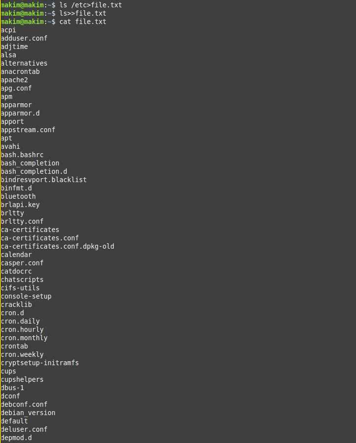
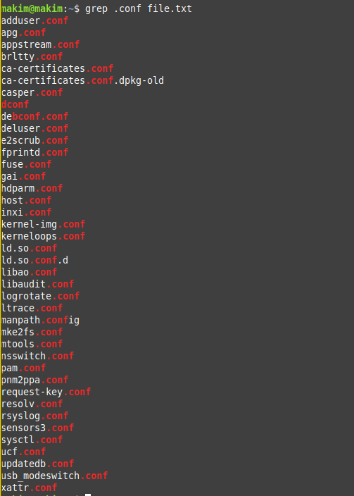
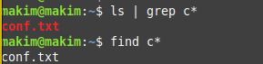
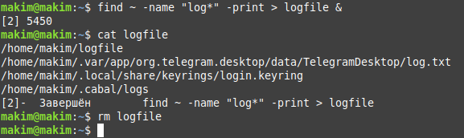
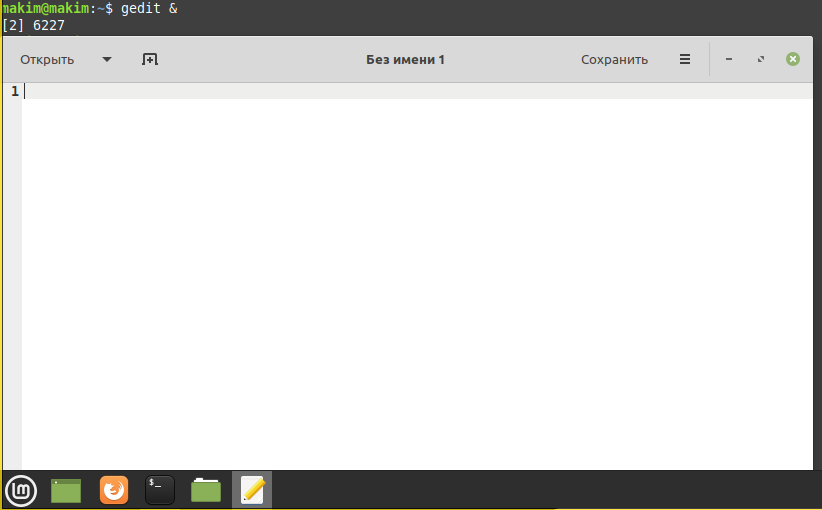
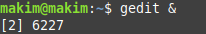
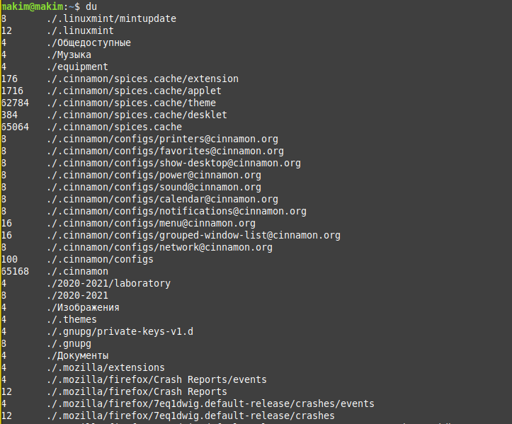
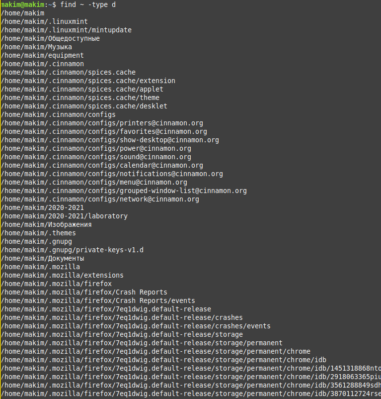

---
# Front matter
title: "Отчет по лабораторной работе №7"
subtitle: "по дисциплине: Операционные системы"
author: "Ким Михаил Алексеевич"

# Generic otions
lang: ru-RU
toc-title: "Содержание"

# Bibliography
bibliography: bib/cite.bib
csl: pandoc/csl/gost-r-7-0-5-2008-numeric.csl

# Pdf output format
toc: true # Table of contents
toc_depth: 2
lof: false # List of figures
lot: false # List of tables
fontsize: 12pt
linestretch: 1.5
papersize: a4
documentclass: scrreprt
## I18n
polyglossia-lang:
  name: russian
  options:
	- spelling=modern
	- babelshorthands=true
polyglossia-otherlangs:
  name: english
### Fonts
mainfont: PT Serif
romanfont: PT Serif
sansfont: PT Sans
monofont: PT Mono
mainfontoptions: Ligatures=TeX
romanfontoptions: Ligatures=TeX
sansfontoptions: Ligatures=TeX,Scale=MatchLowercase
monofontoptions: Scale=MatchLowercase,Scale=0.9
## Biblatex
biblatex: true
biblio-style: "gost-numeric"
biblatexoptions:
  - parentracker=true
  - backend=biber
  - hyperref=auto
  - language=auto
  - autolang=other*
  - citestyle=gost-numeric
## Misc options
indent: true
header-includes:
  - \linepenalty=10 # the penalty added to the badness of each line within a paragraph (no associated penalty node) Increasing the value makes tex try to have fewer lines in the paragraph.
  - \interlinepenalty=0 # value of the penalty (node) added after each line of a paragraph.
  - \hyphenpenalty=50 # the penalty for line breaking at an automatically inserted hyphen
  - \exhyphenpenalty=50 # the penalty for line breaking at an explicit hyphen
  - \binoppenalty=700 # the penalty for breaking a line at a binary operator
  - \relpenalty=500 # the penalty for breaking a line at a relation
  - \clubpenalty=150 # extra penalty for breaking after first line of a paragraph
  - \widowpenalty=150 # extra penalty for breaking before last line of a paragraph
  - \displaywidowpenalty=50 # extra penalty for breaking before last line before a display math
  - \brokenpenalty=100 # extra penalty for page breaking after a hyphenated line
  - \predisplaypenalty=10000 # penalty for breaking before a display
  - \postdisplaypenalty=0 # penalty for breaking after a display
  - \floatingpenalty = 20000 # penalty for splitting an insertion (can only be split footnote in standard LaTeX)
  - \raggedbottom # or \flushbottom
  - \usepackage{float} # keep figures where there are in the text
  - \floatplacement{figure}{H} # keep figures where there are in the text
---

# Цель работы

Ознакомление с инструментами поиска файлов и фильтрации текстовых данных. Приобретение практических навыков: по управлению процессами (и заданиями), по проверке использования диска и обслуживанию файловых систем.

# Выполнение лабораторной работы

1. Осуществляем вход в систему, используя соответствующее имя пользователя.

2. Записывем в файл file.txt названия файлов, содержащихся в каталоге /etc. Дописываем в этот же файл названия файлов, содержащихся в домашнем каталоге. Выводим файл на консоль. (рис. 2.1)

    ```
    ls /etc > file.txt
    ls >> file.txt
    ```

    

3. Выводим имена всех файлов, имеющих расширение .conf. (рис. 2.2)

    ```
    grep .conf file.txt
    ```

    

    
4. Определяем, какие файлы в домашнем каталоге имеют имена, начинавшиеся с символа c. Используем несколько вариантов, чтобы это сделать. (рис. 2.3)

    ```
    find c*
    ls | grep c*
    ```

    

5. Выводим на экран (по странично) имена файлов из каталога /etc, начинающиеся с символа h. (рис. 2.4)

    ```
    find /etc -name "h*"
    ```

    

6. Запускаем в фоновом режиме процесс, который будет записывать в файл ~/logfile файлы, имена которых начинаются с log. (рис. 2.5)

    ```
    find ~ -name "log*" -print > logfile&
    ```

    

7. Удаляем файл ~/logfile.

    ```
    rm logfile
    ```

8. Запускаем из консоли в фоновом режиме редактор gedit. (рис. 2.6)

    ```
    gedit &
    ```

    

9. Определяем идентификатор процесса gedit, используя команду ps, конвейер и фильтр grep. Определяем этот идентификатор более простым способом: при запуске процесса в консоле уже определился его PID. (рис. 2.7, 2.8)

    ```
    ps | grep gedit
    ```

    

    

10. Читаем справку (man) команды kill, после чего используем её для завершения процесса gedit. (рис. 2.9, 2.10)

    ```
    man kill
    kill 6227
    ```

    

11. Выполняем команды df и du, предварительно получив более подробную информацию об этих командах, с помощью команды man. (рис. 2.10)

    ```
    man df
    man du
    df
    du
    ```

    

    

    

12. Воспользовавшись справкой команды find, выводим имена всех директорий, имеющихся в домашнем каталоге. (рис. 2.13)

    ```
    find ~ -type d
    find ~ -maxdepth 1 -type d
    ```

    

    


# Выводы

Мы ознакомились с инструментами поиска файлов и фильтрации текстовых данных. Приобрели практические навыки: по управлению процессами (и заданиями), по проверке использования диска и обслуживанию файловых систем.

# Термины

* Файловая система (ФС) — архитектура хранения данных, которые могут находиться в разделах жесткого диска и ОП.

* Точка монтирования — каталог (путь к каталогу), к которому присоединяются файлы устройств.

* Каталог, он же директория, (от англисйкого Directory) – это объект в ФС (файловой системе), необходимый для того, чтобы упросить работу с файлами.

* Домашний каталог - каталог, предназначенный для хранения собственных данных пользователя Linux. Как правило, является текущим непосредственно после регистрации пользователя в системе.

* Команда - записанный по специальным правилам текст (возможно с аргументами), представляющий собой указание на выполнение какой-либо функций (или действий) в операционной системе.

* Конвейер (pipe) служит для объединения простых команд или утилит в цепочки, в которых результат работы предыдущей команды передаётся последующей.

* PIP. Любой команде, выполняемой в системе, присваивается идентификатор процесса (process ID). Получить информацию о процессе и управлять им, пользуясь идентификатором процесса, можно из любого окна командного интерпретатора.