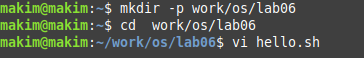
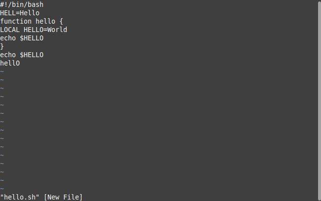
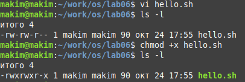
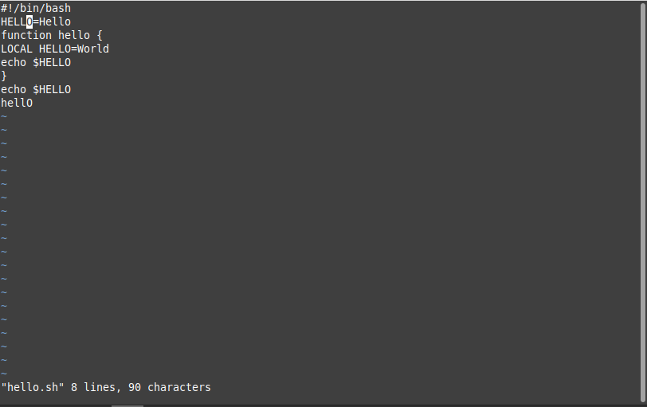
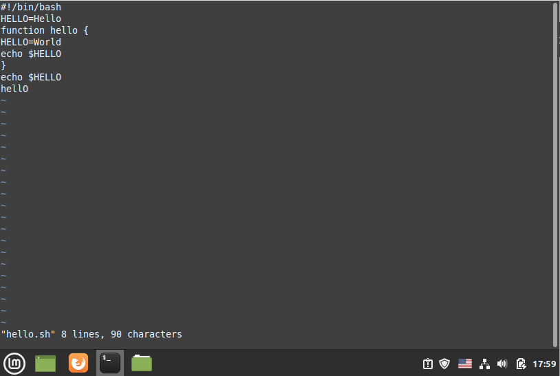
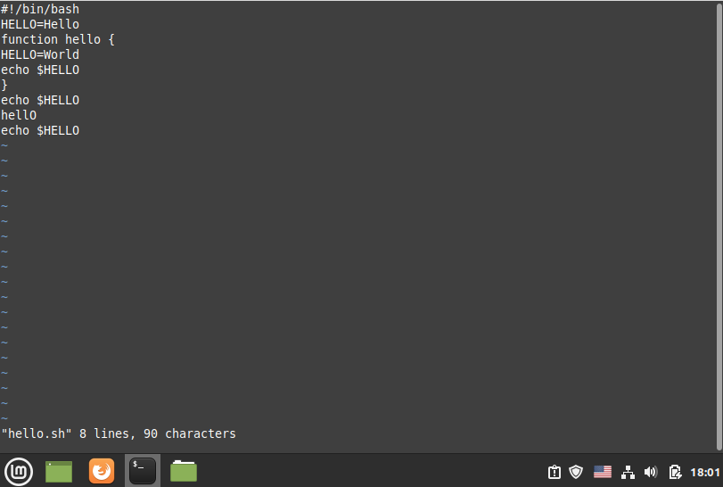
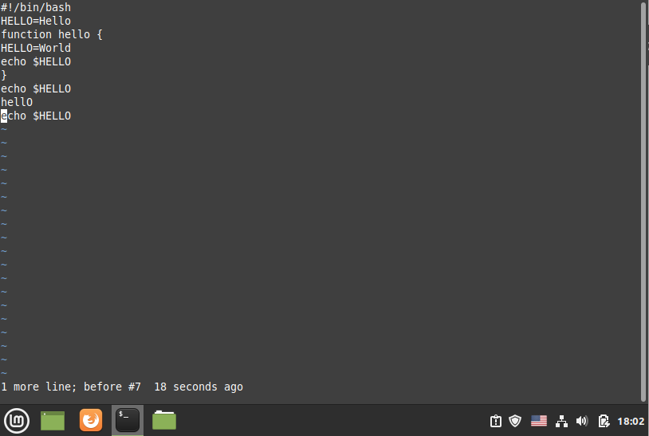
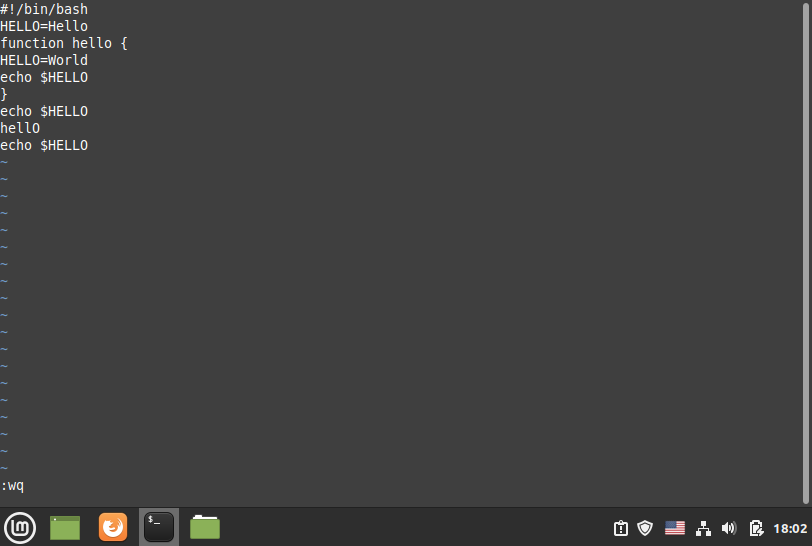

---
# Front matter
title: "Лабораторная работа №9"
subtitle: "Текстовой редактор vi"
author: "Ким Михаил Алексеевич"

# Generic otions
lang: ru-RU
toc-title: "Содержание"

# Bibliography
bibliography: bib/cite.bib
csl: pandoc/csl/gost-r-7-0-5-2008-numeric.csl

# Pdf output format
toc: true # Table of contents
toc_depth: 2
lof: false # List of figures
lot: false # List of tables
fontsize: 12pt
linestretch: 1.5
papersize: a4
documentclass: scrreprt
## I18n
polyglossia-lang:
  name: russian
  options:
	- spelling=modern
	- babelshorthands=true
polyglossia-otherlangs:
  name: english
### Fonts
mainfont: PT Serif
romanfont: PT Serif
sansfont: PT Sans
monofont: PT Mono
mainfontoptions: Ligatures=TeX
romanfontoptions: Ligatures=TeX
sansfontoptions: Ligatures=TeX,Scale=MatchLowercase
monofontoptions: Scale=MatchLowercase,Scale=0.9
## Biblatex
biblatex: true
biblio-style: "gost-numeric"
biblatexoptions:
  - parentracker=true
  - backend=biber
  - hyperref=auto
  - language=auto
  - autolang=other*
  - citestyle=gost-numeric
## Misc options
indent: true
header-includes:
  - \linepenalty=10 # the penalty added to the badness of each line within a paragraph (no associated penalty node) Increasing the value makes tex try to have fewer lines in the paragraph.
  - \interlinepenalty=0 # value of the penalty (node) added after each line of a paragraph.
  - \hyphenpenalty=50 # the penalty for line breaking at an automatically inserted hyphen
  - \exhyphenpenalty=50 # the penalty for line breaking at an explicit hyphen
  - \binoppenalty=700 # the penalty for breaking a line at a binary operator
  - \relpenalty=500 # the penalty for breaking a line at a relation
  - \clubpenalty=150 # extra penalty for breaking after first line of a paragraph
  - \widowpenalty=150 # extra penalty for breaking before last line of a paragraph
  - \displaywidowpenalty=50 # extra penalty for breaking before last line before a display math
  - \brokenpenalty=100 # extra penalty for page breaking after a hyphenated line
  - \predisplaypenalty=10000 # penalty for breaking before a display
  - \postdisplaypenalty=0 # penalty for breaking after a display
  - \floatingpenalty = 20000 # penalty for splitting an insertion (can only be split footnote in standard LaTeX)
  - \raggedbottom # or \flushbottom
  - \usepackage{float} # keep figures where there are in the text
  - \floatplacement{figure}{H} # keep figures where there are in the text
---

# Цель работы

Познакомиться с операционной системой Linux. Получить практические навыки работы с редактором vi, установленным по умолчанию практически во всех дистрибутивах.

# Выполнение лабораторной работы

1. Создаём каталог с именем ~/work/os/lab06. (рис. 2.1)

    ```
    mkdir -p work/os/lab06
    ```

2. Переходим в созданный каталог. (рис. 2.1)

    ```
    cd work/os/lab06
    ```

3. Вызываем vi и создаём файл hello.sh. (рис. 2.1)

    ```
    vi hello.sh 
    ```

    

4. Нажимаем клавишу ```i``` и вводим следующий текст. (рис. 2.2)

    ```
    i — вставить текст перед курсором
    ```
    ```
    #!/bin/bash
    HELL=Hello
    function hello{
        LOCAL HELLO=World
        echo $HELLO
    }
    echo $HELLO
    hello
    ```

    

5. Нажимаем клавишу ```Esc``` для перехода в командный режим после завершения ввода текста.

6. Нажимаем ```:``` для перехода в режим последней строки/ Вводим w(записать) и q(выйти), а затем нажмите клавишу Enter для сохранения вашего текста и завершения работы. (рис. 2.3)

   

7. Делаем файл исполняемым. (рис. 2.4)

    ```
    chmod +x hello.sh 
    ```

    

8. Вызываем vi на редактирование файла vi ~/work/os/lab06/hello.sh.

    ```
    vi ~/work/os/lab06/hello.sh
    ```

9. Устанавливаем курсор в конец слова HELL второй строки. (рис. 2.5)

    ```
    i — вставить текст перед курсором;
    ```

10. Переходим в режим вставки и заменяем на HELLO. Нажимаем ```Esc``` для возврата в командный режим. (рис. 2.5)

    

11. Устанавливаем курсор на четвертую строку и стираем слово LOCAL. (рис. 2.6)

    ```
    x — удалить один символ;
    d w — удалить одно слово.
    ```

    

12. Устанавливаем курсор на последней строке файла. Вставляем после неё строку, содержащую следующий текст: ```echo $HELLO``` (рис. 2.7)

    

13. Нажимаем ```Esc``` для перехода в командный режим. (рис. 2.20)

14. Удаляем последнюю строку. (рис. 2.8)

    ```
    d 0 — удалить текст от начала строки до позиции курсора;
    ```

    

15. Вводим команду отмены изменений ```u``` для отмены последней команды.  (рис. 2.9)

    ```
    u — отменить последнее изменение;
    ```

    

16. Вводим символ ```:``` для перехода в режим последней строки. Записываем произведённые изменения и выходим из vi. (рис. 2.10)

    ```
    :wq
    ```

    


# Выводы

Мы углубили своё понимание операционной системой Linux. получили практические навыки работы с редактором vi. Разобрали и опробывали его основные функции и возможности.

# Термины

* Каталог, он же директория, (от англисйкого Directory) – это объект в ФС (файловой системе), необходимый для того, чтобы упросить работу с файлами.

* Домашний каталог - каталог, предназначенный для хранения собственных данных пользователя Linux. Как правило, является текущим непосредственно после регистрации пользователя в системе.

* Команда - записанный по специальным правилам текст (возможно с аргументами), представляющий собой указание на выполнение какой-либо функций (или действий) в операционной системе.

* Командный режим — предназначен для ввода команд редактирования и навигации по редактируемому файлу.

* Режим вставки — предназначен для ввода содержания редактируемого файла.

* Режим последней (или командной) строки — используется для записи измененийв файл и выхода из редактора.

* Набор разрешений — это три блока прав доступа: права доступа для владельца файла, права доступа для группы, права доступа для всех остальных.