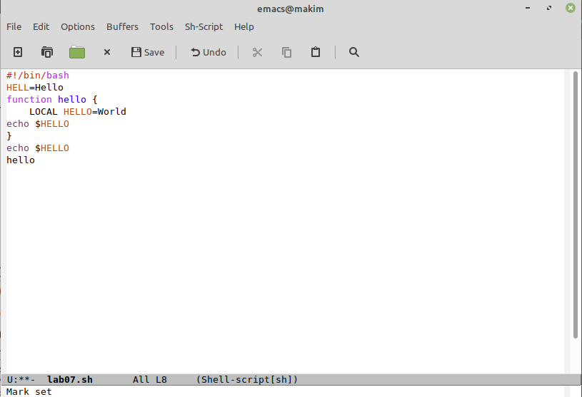
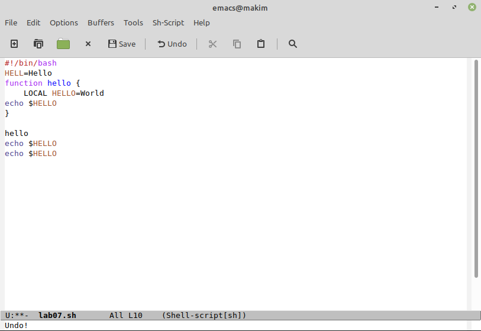
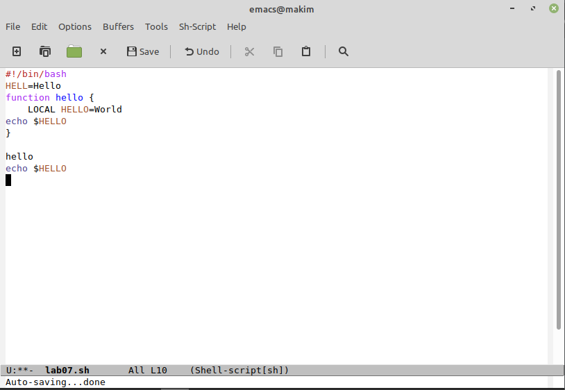
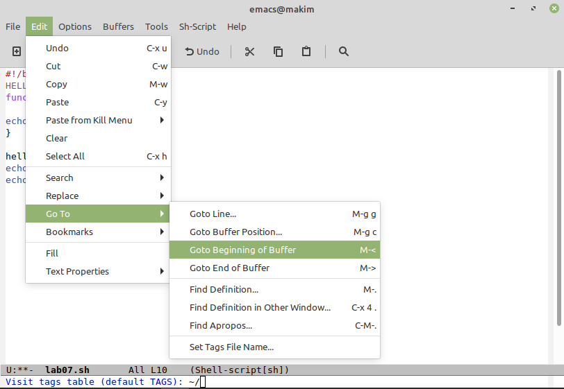
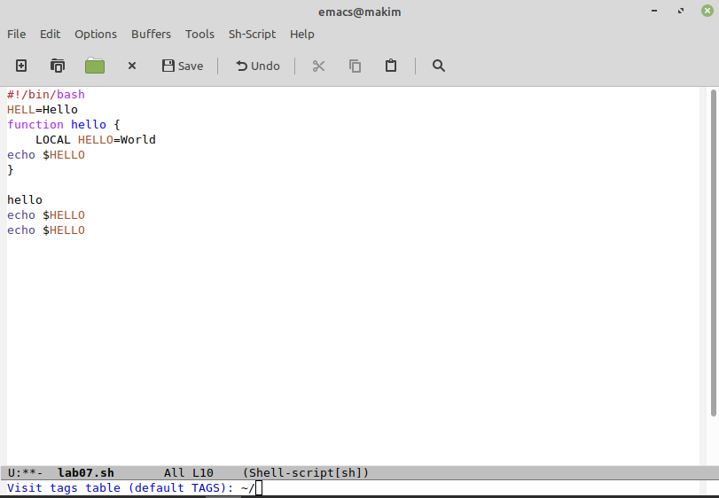
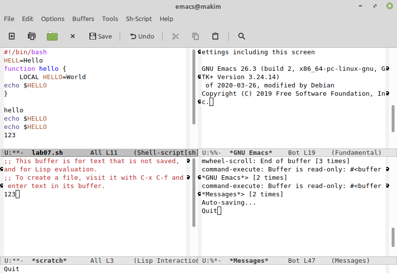
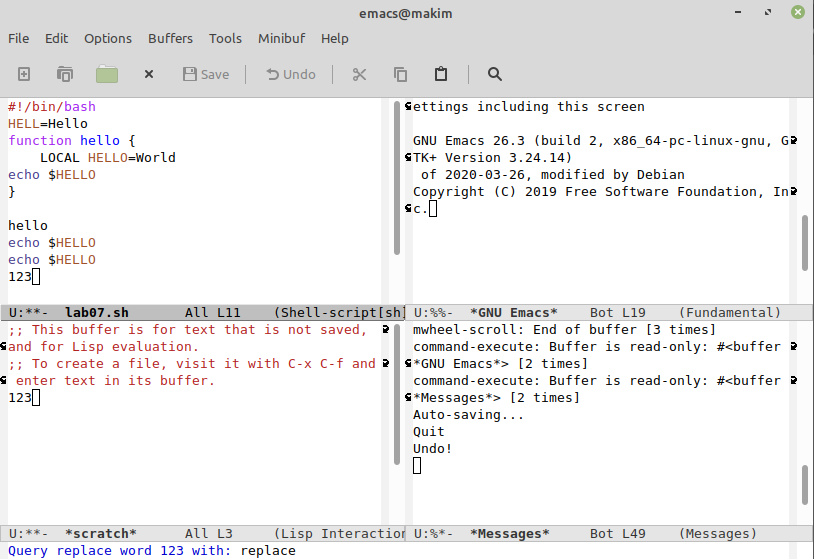
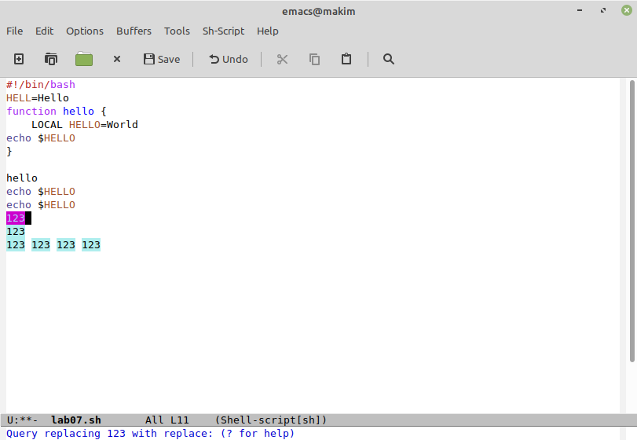
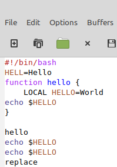
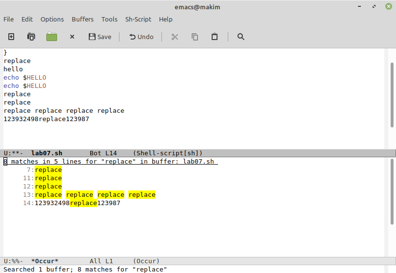

---
# Front matter
title: "Лабораторная работа №10"
subtitle: "Текстовой редактор emacs"
author: "Ким Михаил Алексеевич"

# Generic otions
lang: ru-RU
toc-title: "Содержание"

# Bibliography
bibliography: bib/cite.bib
csl: pandoc/csl/gost-r-7-0-5-2008-numeric.csl

# Pdf output format
toc: true # Table of contents
toc_depth: 2
lof: false # List of figures
lot: false # List of tables
fontsize: 12pt
linestretch: 1.5
papersize: a4
documentclass: scrreprt
## I18n
polyglossia-lang:
  name: russian
  options:
	- spelling=modern
	- babelshorthands=true
polyglossia-otherlangs:
  name: english
### Fonts
mainfont: PT Serif
romanfont: PT Serif
sansfont: PT Sans
monofont: PT Mono
mainfontoptions: Ligatures=TeX
romanfontoptions: Ligatures=TeX
sansfontoptions: Ligatures=TeX,Scale=MatchLowercase
monofontoptions: Scale=MatchLowercase,Scale=0.9
## Biblatex
biblatex: true
biblio-style: "gost-numeric"
biblatexoptions:
  - parentracker=true
  - backend=biber
  - hyperref=auto
  - language=auto
  - autolang=other*
  - citestyle=gost-numeric
## Misc options
indent: true
header-includes:
  - \linepenalty=10 # the penalty added to the badness of each line within a paragraph (no associated penalty node) Increasing the value makes tex try to have fewer lines in the paragraph.
  - \interlinepenalty=0 # value of the penalty (node) added after each line of a paragraph.
  - \hyphenpenalty=50 # the penalty for line breaking at an automatically inserted hyphen
  - \exhyphenpenalty=50 # the penalty for line breaking at an explicit hyphen
  - \binoppenalty=700 # the penalty for breaking a line at a binary operator
  - \relpenalty=500 # the penalty for breaking a line at a relation
  - \clubpenalty=150 # extra penalty for breaking after first line of a paragraph
  - \widowpenalty=150 # extra penalty for breaking before last line of a paragraph
  - \displaywidowpenalty=50 # extra penalty for breaking before last line before a display math
  - \brokenpenalty=100 # extra penalty for page breaking after a hyphenated line
  - \predisplaypenalty=10000 # penalty for breaking before a display
  - \postdisplaypenalty=0 # penalty for breaking after a display
  - \floatingpenalty = 20000 # penalty for splitting an insertion (can only be split footnote in standard LaTeX)
  - \raggedbottom # or \flushbottom
  - \usepackage{float} # keep figures where there are in the text
  - \floatplacement{figure}{H} # keep figures where there are in the text
---

# Цель работы

Познакомиться с операционной системой Linux. Получить практические навыки работы с редактором Emacs.

# Выполнение лабораторной работы

1. Открываем emacs. (рис. 2.1)

    ```
    emacs &
    ```

2. Создаём файл lab07.sh с помощью комбинации клавиш. (рис. 2.1)

    ```
    Ctrl-x Ctrl-f (C-x C-f)
    ```

3. Набираем текст. (рис. 2.1)

    ```
    #!/bin/bash
    HELL=Hello
    function hello {
        LOCAL HELLO=World
        echo $HELLO
    }
    echo $HELLO
    hello
    ```

    

4. Вырезаем одной командой целую строку. (рис. 2.2)

    ```
    Ctrl-k  (С-k)
    ```

5. Вставляем эту строку в конец файла. (рис. 2.2)

    ```
    Ctrl-y  (C-y)
    ```

    

6. Выделяем область текста. (рис. 2.3)

    ```
    Ctrl-space (C-space)
    ```

    

7. Копируем область в буфер обмена. (рис. 2.4)

    ```
    Alt-w  (M-w)
    ```

8. Вставлеям область в конец файла. (рис. 2.4)

    ```
    Ctrl-y  (C-y)
    ```

    

9. Вновь выделяем эту область и вырезаем её. (рис. 2.53)

    ```
    Ctrl-space (C-space)
    Ctrl-w (C-w)
    ```

    

10. Отменяем последнее действие. (рис. 2.6)

    ```
    Ctrl-/ (C-/)
    ```

    

11. Перемещаем курсор в начало строки. (рис. 2.7)

    ```
    Ctrl-a (C-a)
    ```

    

12. Перемещаем курсор в конец строки. (рис. 2.8)

    ```
    Ctrl-e (C-e)
    ```

    

13. Перемещаем курсор в начало буфера. (рис. 2.9, 2.10)

    ```
    Alt-< (M-<)
    ```

    

    

14. Перемещаем курсор в конец буфера. (рис. 2.11)

    ```
    Alt-> (M->)
    ```

    

15. Выводим список активных буферов на экран. (рис. 2.12)

    ```
    Ctrl-x Ctrl-b (C-x C-b)
    ```

    

16. Перемещаемся в открытое окно со списком открытых буферов и переключаемся на другой буфер. (рис. 2.21 - 2.23)

    ```
    Ctrl-x o (C-x o)
    ```

    

    

    

17. Закрываем это окно. (рис. 2.24)

    ```
    Ctrl-x 0 (C-x 0)
    ```

    

18. Переключаемся между буферами, но уже без вывода их списка на экран. (рис. 2.25 - 2.26)

    ```
    Ctrl-x b (C-x b)
    ```

    

19. Делим фрейм на 4 части: на два окна по вертикали, а затем каждое из этих окон на две части по горизонтали. (рис. 2.27 - 2.29)

    ```
    Ctrl-x 3 (C-x 3)
    Ctrl-x 2 (C-x 2)
    Ctrl-x o (C-x o)
    Ctrl-x o (C-x o)
    Ctrl-x 2 (C-x 2)
    ```

    

20. В каждом из четырёх созданных окон открываем новый буфер и вводим несколько строк текста. (рис. 2.30)

    ```
    Ctrl-x b (C-x b)
    Ctrl-x o (C-x o)
    ...
    ```

    

21. Переключаемся в режим поиска и находим несколько слов, присутствующих в тексте. (рис. 2.31)

    ```
    Ctrl-s (C-s)
    ```

    

22. Переключаемся между результатами поиска. (рис. 2.32)

    ```
    Ctrl-s  (C-s)
    ```

    

23. Выходим из режима поиска. (рис. 2.33)

    ```
    Ctrl-g (C-g)
    ```

    

24. Переходим в режим поиска и замены, вводим текст, который следует найти и заменить, нажимаем Enter, затем вводим текст для замены.  После того как будут подсвечены результаты поиска, нажимаем ```!``` для подтверждения замены. (рис. 2.34 - 2.38)

    ```
    Alt-% (M-%)
    ```

    

    

    

    

25. Пробуем другой режим поиска. Он отличается от предыдущего тем, что показывает только те строчки, где было найдено нужное слово. (рис. 2.)

    ```
    Alt-s o (M-s o)
    ```
    


# Выводы

Мы углубили своё понимание операционной системой Linux. получили практические навыки работы с редактором emacs. Разобрали и опробывали его основные функции и возможности.

# Термины

* Каталог, он же директория, (от англисйкого Directory) – это объект в ФС (файловой системе), необходимый для того, чтобы упросить работу с файлами.

* Домашний каталог - каталог, предназначенный для хранения собственных данных пользователя Linux. Как правило, является текущим непосредственно после регистрации пользователя в системе.

* Команда - записанный по специальным правилам текст (возможно с аргументами), представляющий собой указание на выполнение какой-либо функций (или действий) в операционной системе.

* Буфер — объект, представляющий какой-либо текст.

* Фрейм соответствует окну в обычном понимании этого слова. Каждый фрейм содержит область вывода и одно или несколько окон Emacs.

* Окно — прямоугольная область фрейма, отображающая один из буферов.

* Область вывода — одна или несколько строк внизу фрейма, в которой Emacs выводит различные сообщения, а также запрашивает подтверждения и дополнительную информацию от пользователя.

* Минибуфер используется для ввода дополнительной информации и всегда отображается в области вывода.

* Точка вставки — место вставки (удаления) данных в буфере.