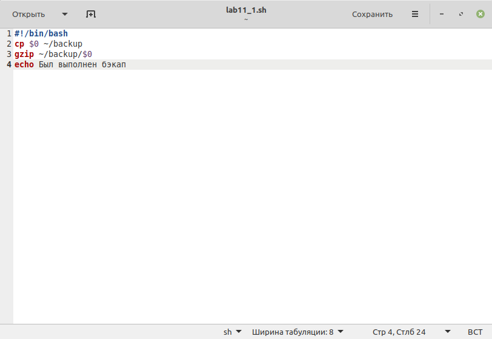
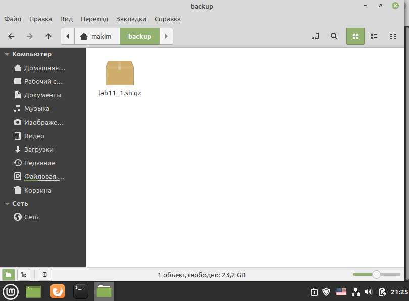
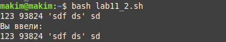
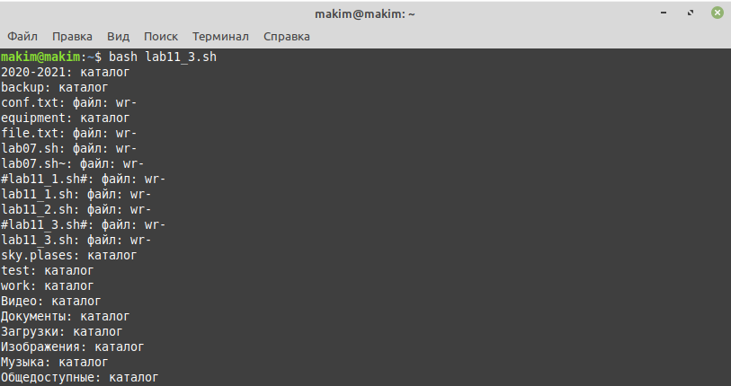
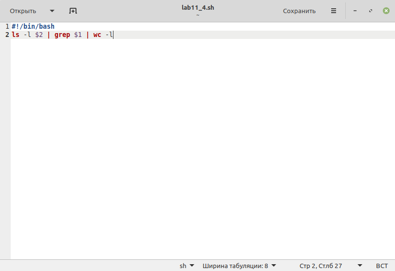
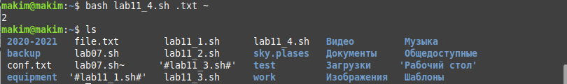

---
# Front matter
title: "Лабораторная работа №11"
subtitle: "Программирование в командном процессоре ОС UNIX. Командные файлы"
author: "Ким Михаил Алексеевич"

# Generic otions
lang: ru-RU
toc-title: "Содержание"

# Bibliography
bibliography: bib/cite.bib
csl: pandoc/csl/gost-r-7-0-5-2008-numeric.csl

# Pdf output format
toc: true # Table of contents
toc_depth: 2
lof: false # List of figures
lot: false # List of tables
fontsize: 12pt
linestretch: 1.5
papersize: a4
documentclass: scrreprt
## I18n
polyglossia-lang:
  name: russian
  options:
	- spelling=modern
	- babelshorthands=true
polyglossia-otherlangs:
  name: english
### Fonts
mainfont: PT Serif
romanfont: PT Serif
sansfont: PT Sans
monofont: PT Mono
mainfontoptions: Ligatures=TeX
romanfontoptions: Ligatures=TeX
sansfontoptions: Ligatures=TeX,Scale=MatchLowercase
monofontoptions: Scale=MatchLowercase,Scale=0.9
## Biblatex
biblatex: true
biblio-style: "gost-numeric"
biblatexoptions:
  - parentracker=true
  - backend=biber
  - hyperref=auto
  - language=auto
  - autolang=other*
  - citestyle=gost-numeric
## Misc options
indent: true
header-includes:
  - \linepenalty=10 # the penalty added to the badness of each line within a paragraph (no associated penalty node) Increasing the value makes tex try to have fewer lines in the paragraph.
  - \interlinepenalty=0 # value of the penalty (node) added after each line of a paragraph.
  - \hyphenpenalty=50 # the penalty for line breaking at an automatically inserted hyphen
  - \exhyphenpenalty=50 # the penalty for line breaking at an explicit hyphen
  - \binoppenalty=700 # the penalty for breaking a line at a binary operator
  - \relpenalty=500 # the penalty for breaking a line at a relation
  - \clubpenalty=150 # extra penalty for breaking after first line of a paragraph
  - \widowpenalty=150 # extra penalty for breaking before last line of a paragraph
  - \displaywidowpenalty=50 # extra penalty for breaking before last line before a display math
  - \brokenpenalty=100 # extra penalty for page breaking after a hyphenated line
  - \predisplaypenalty=10000 # penalty for breaking before a display
  - \postdisplaypenalty=0 # penalty for breaking after a display
  - \floatingpenalty = 20000 # penalty for splitting an insertion (can only be split footnote in standard LaTeX)
  - \raggedbottom # or \flushbottom
  - \usepackage{float} # keep figures where there are in the text
  - \floatplacement{figure}{H} # keep figures where there are in the text
---

# Цель работы

Изучить основы программирования в оболочке ОС UNIX/Linux. Научиться писать небольшие командные файлы.

# Выполнение лабораторной работы

1. Пишем скрипт, который при запуске будет делать резервную копию самого себя (то есть файла, в котором содержится его исходный код) в другую директорию backup в вашем домашнем каталоге. При этом файл будет архивироваться с помощью gzip. (рис. 2.1-2.3)

    ```
    // Используем шебанг, чтобы сообщить командной оболочке, каким образом мы будем интерпретировать сценарий
    #!/bin/bash

    // копируем командный файл в директорию backup
    // $0 содержит в себе имя командного файла
    cp $0 ~/backup

    // архивируем командный файл
    gzip ~/backup/$0
    ```

    

    

    

2. Пишем командный файла, который обрабатывает любое произвольное число аргументов командной строки, после чего скрипт последовательно распечатывает значения всех переданных аргументов. (рис. 2.4 - 2.5)

    ```
    // Используем шебанг, чтобы сообщить командной оболочке, каким образом мы будем интерпретировать сценарий
    #!/bin/bash

    // создаём массив array, где будут храниться все переданные значения
    declare -a array

    // считываем значения в массив array
    read -a array

    // выводим весь массив array
    echo Вы ввели:
    echo ${array[@]}
    ```

    

    

3. Пишем командный файл — аналог команды ls (без использования самой этой команды и команды dir). Он выводит информацию о нужном каталоге и выводит информацию о возможностях доступа к файлам этого каталога. (рис. 2.6 - 2.8)

    ```
    #!/bin/bash
    // Запускаем цикл, который проходит по всем элементам каталога.
    // В самом цикле делаем ветвеления if с командой test в условии.
    // Благодаря команде test мы узнаем всю необходимую информацию.
    // И в зависимости от этой информации выводим результат.

    for i in *
    do
    if test -d $i; then
        echo $i': 'каталог
    else
        echo -n $i': 'файл': '
        if test -w $i; then
            echo -n w
            else echo -n -
        fi
        if test -r $i; then
            echo -n r
            else echo -n -
        fi
        if test -x $i;
            then echo -n x
            else echo -
        fi
    fi
    done
    ```

    

    

    


4. Пишем командный файл, который получает в качестве аргумента командной строки формат файла (.txt, .doc, .jpg, .pdf и т.д.) и вычисляет количество таких файлов в указанной директории. Путь к директории также передаётся в виде аргумента командной строки.(рис. 2.9 - 2.10)

    ```
    #!bin/bash

    // Первый аргумент (ему соответствует $1) у нас отвечает за формат (.txt, .doc и т.д.)
    // Второй аргумент ($2) отвечает за путь, по которому мы будем выводить информацию
    // Выводим содерживое директории с помощью ls
    // Сортируем содерживое директории с помощью grep
    // Подсчитываем с помощью wc
    ls -l $2 | grep $1 | wc -l
    ```

    

    


# Выводы

Мы изучили основы программирования в оболочке ОС UNIX/Linux. Научились писать небольшие командные файлы. А также углубили свое понимание консольных команд для Linux

# Термины

* Командный процессор (командная оболочка, интерпретатор команд shell) — это программа, позволяющая пользователю взаимодействовать с операционной системой компьютера.

* POSIX (Portable Operating System Interface for Computer Environments) — набор стандартов описания интерфейсов взаимодействия операционной системы и прикладных программ. 

* Последовательность команд может быть помещена в текстовый файл. Такой файл называется командным.

* Флаги — это опции командной строки, обычно помеченные знаком минус; Например, для команды ls флагом может являться -F.

* Каталог, он же директория, (от англисйкого Directory) – это объект в ФС (файловой системе), необходимый для того, чтобы упросить работу с файлами.

* Домашний каталог - каталог, предназначенный для хранения собственных данных пользователя Linux. Как правило, является текущим непосредственно после регистрации пользователя в системе.

* Команда - записанный по специальным правилам текст (возможно с аргументами), представляющий собой указание на выполнение какой-либо функций (или действий) в операционной системе.