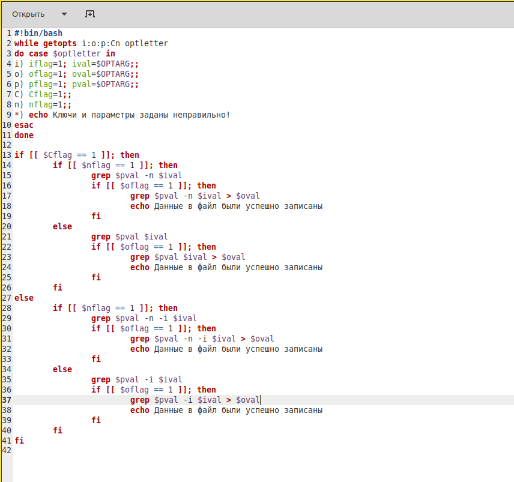
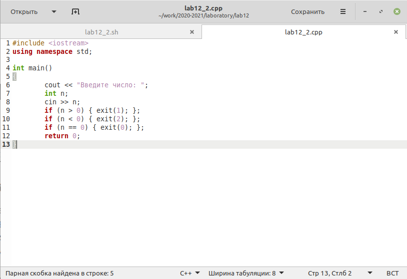
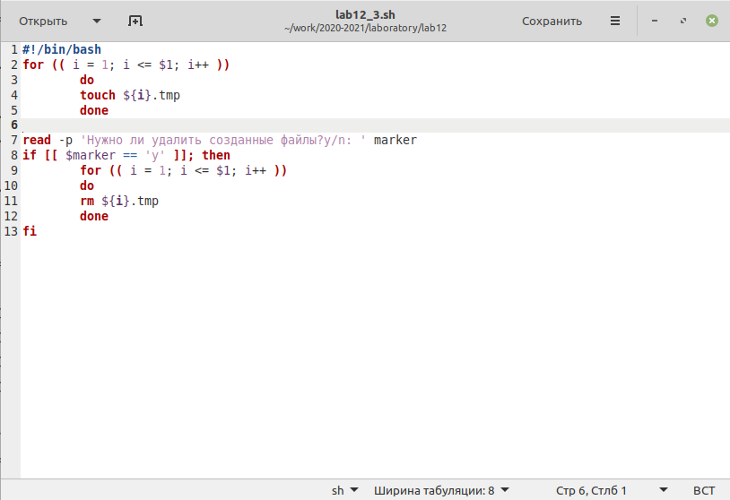
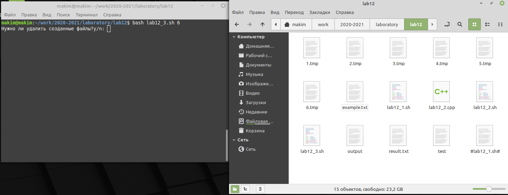
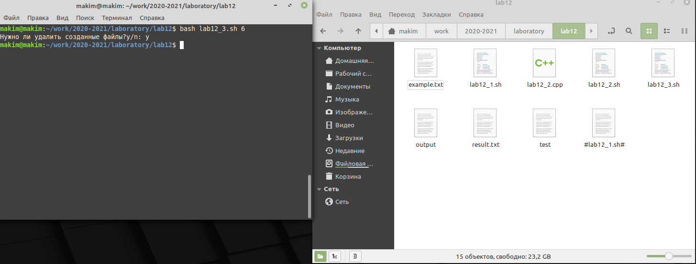
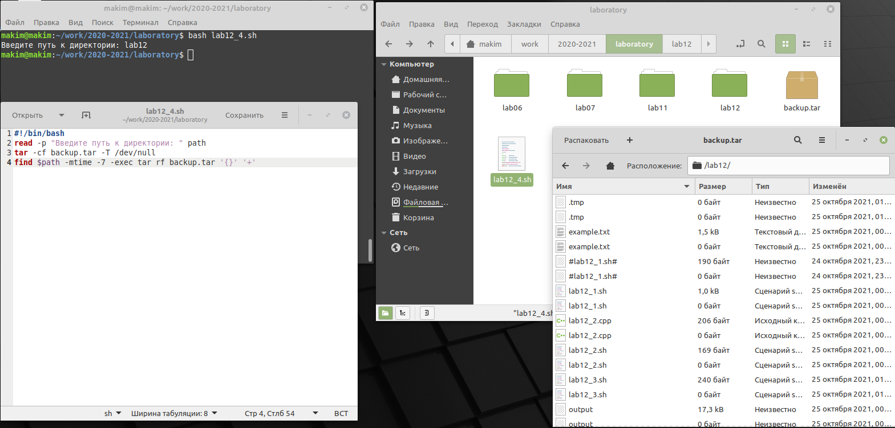

---
# Front matter
title: "Лабораторная работа №12"
subtitle: "Программирование в командном процессоре ОС UNIX. Ветвления и циклы"
author: "Ким Михаил Алексеевич"

# Generic otions
lang: ru-RU
toc-title: "Содержание"

# Bibliography
bibliography: bib/cite.bib
csl: pandoc/csl/gost-r-7-0-5-2008-numeric.csl

# Pdf output format
toc: true # Table of contents
toc_depth: 2
lof: false # List of figures
lot: false # List of tables
fontsize: 12pt
linestretch: 1.5
papersize: a4
documentclass: scrreprt
## I18n
polyglossia-lang:
  name: russian
  options:
	- spelling=modern
	- babelshorthands=true
polyglossia-otherlangs:
  name: english
### Fonts
mainfont: PT Serif
romanfont: PT Serif
sansfont: PT Sans
monofont: PT Mono
mainfontoptions: Ligatures=TeX
romanfontoptions: Ligatures=TeX
sansfontoptions: Ligatures=TeX,Scale=MatchLowercase
monofontoptions: Scale=MatchLowercase,Scale=0.9
## Biblatex
biblatex: true
biblio-style: "gost-numeric"
biblatexoptions:
  - parentracker=true
  - backend=biber
  - hyperref=auto
  - language=auto
  - autolang=other*
  - citestyle=gost-numeric
## Misc options
indent: true
header-includes:
  - \linepenalty=10 # the penalty added to the badness of each line within a paragraph (no associated penalty node) Increasing the value makes tex try to have fewer lines in the paragraph.
  - \interlinepenalty=0 # value of the penalty (node) added after each line of a paragraph.
  - \hyphenpenalty=50 # the penalty for line breaking at an automatically inserted hyphen
  - \exhyphenpenalty=50 # the penalty for line breaking at an explicit hyphen
  - \binoppenalty=700 # the penalty for breaking a line at a binary operator
  - \relpenalty=500 # the penalty for breaking a line at a relation
  - \clubpenalty=150 # extra penalty for breaking after first line of a paragraph
  - \widowpenalty=150 # extra penalty for breaking before last line of a paragraph
  - \displaywidowpenalty=50 # extra penalty for breaking before last line before a display math
  - \brokenpenalty=100 # extra penalty for page breaking after a hyphenated line
  - \predisplaypenalty=10000 # penalty for breaking before a display
  - \postdisplaypenalty=0 # penalty for breaking after a display
  - \floatingpenalty = 20000 # penalty for splitting an insertion (can only be split footnote in standard LaTeX)
  - \raggedbottom # or \flushbottom
  - \usepackage{float} # keep figures where there are in the text
  - \floatplacement{figure}{H} # keep figures where there are in the text
---

# Цель работы

Изучить основы программирования в оболочке ОС UNIX. Научится писать более сложные командные файлы с использованием логических управляющих конструкций и циклов.

# Выполнение лабораторной работы

1. Используя команды ```getopts``` и ```grep```, написали командный файл, который анализирует командную строку с ключами: -i inputfile — прочитать данные из указанного файла; -o outputfile — вывести данные в указанный файл; -p шаблон — указать шаблон для поиска; -C — различать большие и малые буквы; -n — выдавать номера строк. В итоге, наш скрипт ищет в указанном файле нужные строки, определяемые ключом -p.(рис. 2.1 - 2.5)

    ```
    #!bin/bash

    // Структура необходимая для работы системы флагов. 
    // При объявлении флага перемнные *flag принимают значение 1.
    // Если за флагом следует информация, то эта информация принимается переменной *val

    #!bin/bash
    while getopts i:o:p:Cn optletter
    do case $optletter in
    i) iflag=1; ival=$OPTARG;;
    o) oflag=1; oval=$OPTARG;;
    p) pflag=1; pval=$OPTARG;;
    C) Cflag=1;;
    n) nflag=1;;
    *) echo Ключи и параметры заданы неправильно!
    esac
    done

    // Пишем ветвления для обработки флагов. 
    // В зависимости от того, какие флаги активны выполняем действия.
    // Для того чтобы обработать входной файл, выходной и шаблон обращаемся к переменным  ival, oval, pval соотвественно.

    if [[ $Cflag == 1 ]]; then
        if [[ $nflag == 1 ]]; then
            grep $pval -n $ival
            if [[ $oflag == 1 ]]; then
                grep $pval -n $ival > $oval
                echo Данные в файл были успешно записаны
            fi
        else
            grep $pval $ival
            if [[ $oflag == 1 ]]; then
                grep $pval $ival > $oval
                echo Данные в файл были успешно записаны
            fi
        fi
    else
        if [[ $nflag == 1 ]]; then
            grep $pval -n -i $ival
            if [[ $oflag == 1 ]]; then
                grep $pval -n -i $ival > $oval
                echo Данные в файл были успешно записаны
            fi
        else
            grep $pval -i $ival
            if [[ $oflag == 1 ]]; then
                grep $pval -i $ival > $oval
                echo Данные в файл были успешно записаны
            fi
        fi
    fi


    ```

    ```
    When the days are cold
    And the cards all fold
    And the saints we see
    Are all made of gold
    when your dreams they fail
    And the ones we hail
    Are the worst of all
    And the blood's run stale
    I wanna hide the truth, I wanna shelter you
    But with the beast inside
    There's nowhere we can hide
    No matter what we breed
    We still are made of greed
    This is my kingdom come
    This is my kingdom come
    When you feel my heat
    Look into my eyes
    It's where my demons hide
    It's where my demons hide
    Don't get too close
    It's dark inside
    It's where my demons hide
    It's where my demons hide
    When the curtain's call
    It's the last of all
    When the lights fade out
    All the sinners crawl
    So they dug your grave
    And the masquerade
    Will come calling out
    At the mess you've made
    Don't wanna let you down
    But I am hell bound
    Though this is all for you
    Don't wanna hide the truth
    No matter what we breed
    We still are made of greed
    This is my kingdom come
    This is my kingdom come
    When you feel my heat
    Look into my eyes
    It's where my demons hide
    It's where my demons hide
    Don't get too close
    It's dark inside
    It's where my demons hide
    It's where my demons hide
    They say it's what you make
    I say it's up to fate
    It's woven in my soul
    I need to let you go
    Your eyes, they shine so bright
    I wanna save that light
    I can't escape this now
    Unless you show me how
    When you feel my heat
    Look into my eyes
    It's where my demons hide
    It's where my demons hide
    Don't get too close
    It's dark inside
    It's where my demons hide
    It's where my demons hide
    ```

    

    

    

    

    

2. Пишем на языке Си программу, которая вводит число и определяет, является ли оно больше нуля, меньше нуля или равно нулю. Затем программа завершается с помощью функции exit(n), передавая информацию в о коде завершения в оболочку. Командный файл вызывает эту программу и, проанализировав с помощью команды ```$?```, выдаёт сообщение о том, какое число было введено.(рис. 2.6 - 2.8)

    ```
    // lab12_2.cpp
    // Принцип работы прост. Вводим число, с помощью if определяем, в какю сторону он отличен от 0. В соотвествии с результатом выходим из программы с помощью exit(n).
    #include <iostream>
    using namespace std;

    int main()
    {
        cout << "Введите число: ";
        int n;
        cin >> n;
        if (n > 0) { exit(1); };
        if (n < 0) { exit(2); };
        if (n == 0) { exit(0); };
        return 0;
    }
    ```

    ```
    //lab12_2.sh

    #!bin/bash

    // Компилируем lab12_2.cpp.
    g++ lab12_2.cpp -o output

    // Открываем результат компиляции
    ./output

    // После завершения программы анализируем результат с помощью case.
    // В условие ставим $? - переменную, которая содержит код завершения последней выполненной команды.
    case $? in
    1) echo Число равно 0;;
    2) echo Число больше 0;;
    3) echo Число меньше 0;;
    esac

    ```

    

    

    


3. Пишем командный файл, который создат указанное число файлов, пронумерованных последовательно от 0 до N (например 0.tmp, 1.tmp, 2 tmp, 3.tmp, 4.tmp и т.д.). Число файлов, которые необходимо создать, передаётся в аргументы командной строки. Этот же командный файл умеет удалять все созданные им файлы.(рис. 2.8 - 2.11)

    ```
    #!/bin/bash
    // Используем цикл for, чтобы пробежаться по всем числам от 1 до нашего аргумента
    // Для каждого числа будет создаваться файл
    for (( i = 1; i <= $1; i++ ))
        do
        touch ${i}.tmp
        done

    // Спрашиваем пользователя, нужно ли удалять созданные файлы
    // Если да, то таким же образом их удаляем
    read -p 'Нужно ли удалить созданные файлы?y/n: ' marker
    if [[ $marker == 'y' ]]; then
        for (( i = 1; i <= $1; i++ ))
        do
        rm ${i}.tmp
        done
    fi
    ```

   

   

   

4. Пишем командный файл, который с помощью команды tar запаковывает в архив все файлы в указанной директории. Модифицируем его так, чтобы запаковывались только те файлы, которые были изменены менее недели тому назад (используем команду find). (рис. 2.12 - 2.13)

    ```
    #!bin/bash
    // Считываем директорию.
    read -p "Enter directory: " folder

    // Содаём пустой архив.
    tar -cf backup7.tar -T /dev/null

    // Используем find с опцией -mtime, которая позволяет отсеивать файлы, в зависимости, от даты их последнего изменения.
    // также используем -exec, который позволяет к каждому найденному файлу применять команду.
    // после -exec ставим команду tar rf backup7.tar, чтобы все найденные файлы архивировать.

    find $folder -mtime -7 -exec tar rf backup7.tar '{}' '+'
    ```

   

   


# Выводы

Мы изучили основы программирования в оболочке ОС UNIX. Закрепили знания, полученные в прошлых работах. Научиись писать более сложные командные файлы с использованием логических управляющих конструкций и циклов.

# Термины

* Командный процессор (командная оболочка, интерпретатор команд shell) — это программа, позволяющая пользователю взаимодействовать с операционной системой компьютера.

* POSIX (Portable Operating System Interface for Computer Environments) — набор стандартов описания интерфейсов взаимодействия операционной системы и прикладных программ. 

* Последовательность команд может быть помещена в текстовый файл. Такой файл называется командным.

* Флаги — это опции командной строки, обычно помеченные знаком минус; Например, для команды ls флагом может являться -F.

* Каталог, он же директория, (от англисйкого Directory) – это объект в ФС (файловой системе), необходимый для того, чтобы упросить работу с файлами.

* Домашний каталог - каталог, предназначенный для хранения собственных данных пользователя Linux. Как правило, является текущим непосредственно после регистрации пользователя в системе.

* Команда - записанный по специальным правилам текст (возможно с аргументами), представляющий собой указание на выполнение какой-либо функций (или действий) в операционной системе.