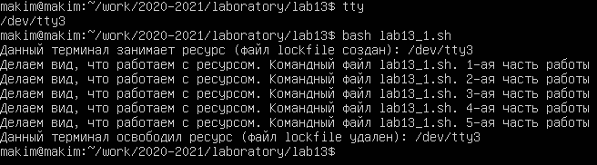
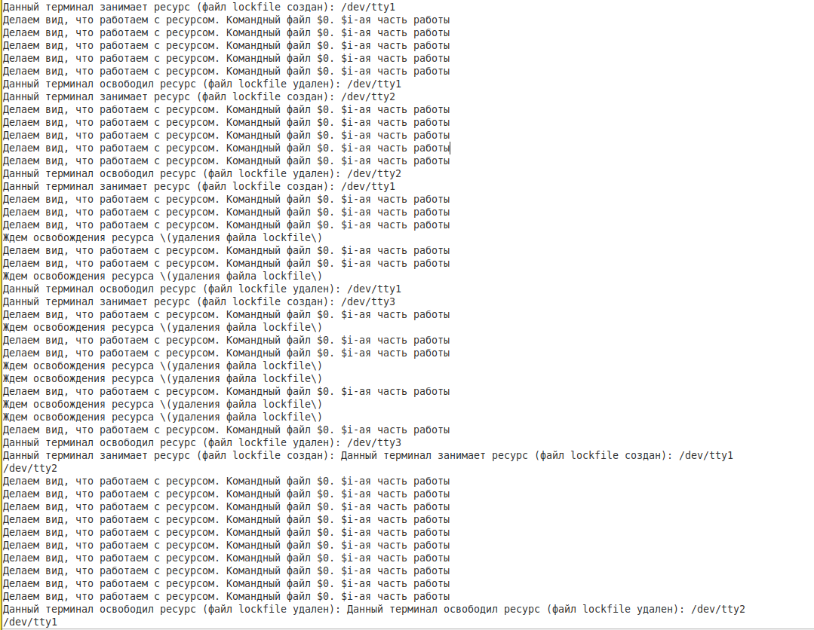
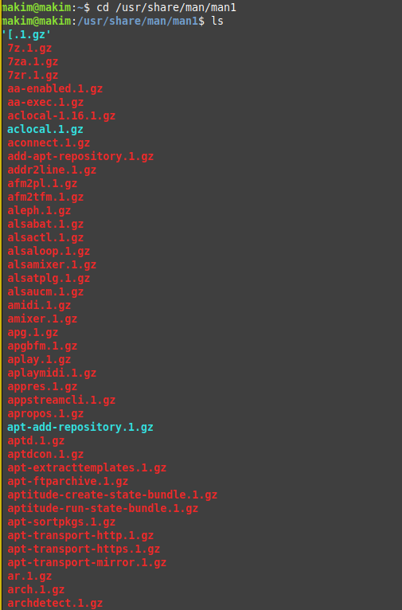
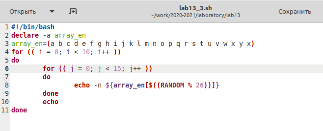

---
# Front matter
title: "Лабораторная работа №13"
subtitle: "Программирование в командном процессоре ОС UNIX. Расширенное программирование"
author: "Ким Михаил Алексеевич"

# Generic otions
lang: ru-RU
toc-title: "Содержание"

# Bibliography
bibliography: bib/cite.bib
csl: pandoc/csl/gost-r-7-0-5-2008-numeric.csl

# Pdf output format
toc: true # Table of contents
toc_depth: 2
lof: false # List of figures
lot: false # List of tables
fontsize: 12pt
linestretch: 1.5
papersize: a4
documentclass: scrreprt
## I18n
polyglossia-lang:
  name: russian
  options:
	- spelling=modern
	- babelshorthands=true
polyglossia-otherlangs:
  name: english
### Fonts
mainfont: PT Serif
romanfont: PT Serif
sansfont: PT Sans
monofont: PT Mono
mainfontoptions: Ligatures=TeX
romanfontoptions: Ligatures=TeX
sansfontoptions: Ligatures=TeX,Scale=MatchLowercase
monofontoptions: Scale=MatchLowercase,Scale=0.9
## Biblatex
biblatex: true
biblio-style: "gost-numeric"
biblatexoptions:
  - parentracker=true
  - backend=biber
  - hyperref=auto
  - language=auto
  - autolang=other*
  - citestyle=gost-numeric
## Misc options
indent: true
header-includes:
  - \linepenalty=10 # the penalty added to the badness of each line within a paragraph (no associated penalty node) Increasing the value makes tex try to have fewer lines in the paragraph.
  - \interlinepenalty=0 # value of the penalty (node) added after each line of a paragraph.
  - \hyphenpenalty=50 # the penalty for line breaking at an automatically inserted hyphen
  - \exhyphenpenalty=50 # the penalty for line breaking at an explicit hyphen
  - \binoppenalty=700 # the penalty for breaking a line at a binary operator
  - \relpenalty=500 # the penalty for breaking a line at a relation
  - \clubpenalty=150 # extra penalty for breaking after first line of a paragraph
  - \widowpenalty=150 # extra penalty for breaking before last line of a paragraph
  - \displaywidowpenalty=50 # extra penalty for breaking before last line before a display math
  - \brokenpenalty=100 # extra penalty for page breaking after a hyphenated line
  - \predisplaypenalty=10000 # penalty for breaking before a display
  - \postdisplaypenalty=0 # penalty for breaking after a display
  - \floatingpenalty = 20000 # penalty for splitting an insertion (can only be split footnote in standard LaTeX)
  - \raggedbottom # or \flushbottom
  - \usepackage{float} # keep figures where there are in the text
  - \floatplacement{figure}{H} # keep figures where there are in the text
---

# Цель работы

Изучить основы программирования в оболочке ОС UNIX. Научиться писать более сложные командные файлы с использованием логических управляющих конструкций и циклов.

# Выполнение лабораторной работы.

1. Написали командный файл, реализующий упрощённый механизм семафоров. Командный файл в течение некоторого времени дожидаться освобождения ресурса, выдавая об этом сообщение, а дождавшись его освобождения, использует его в течение некоторого времени, также выдавая информацию о том, что ресурс используется. К сожалению, у меня не получилось никакими методами перенеправить вывод из одного виртуального терминала на другой. (рис. 2.1 - 2.8)

    ```
    #!/bin/bash

    // Пока существует файл lockfile
    while test -f lockfile
    do
        echo Ждем освобождения ресурса \(удаления файла lockfile\)
        echo 'Ждем освобождения ресурса \(удаления файла lockfile\)' >> res.txt
        sleep 5
    done 

    // Создаем файл lockfile
    touch lockfile
    echo -n 'Данный терминал занимает ресурс (файл lockfile создан): '
    tty
    echo -n 'Данный терминал занимает ресурс (файл lockfile создан): ' >> res.txt
    tty >> res.txt

    // Сообщения просто для того, чтобы показать возможность работы в это время
    for (( i = 1; i <= 5; i++ ))
    do
        echo Делаем вид, что работаем с ресурсом. Командный файл $0. $i-ая часть работы
        echo 'Делаем вид, что работаем с ресурсом. Командный файл $0. $i-ая часть работы' >> res.txt
        sleep 3
    done

    // Удаляем файл lockfile
    rm lockfile
    echo -n 'Данный терминал освободил ресурс (файл lockfile удален): '
    tty
    echo -n 'Данный терминал освободил ресурс (файл lockfile удален): ' >> res.txt
    tty >> res.txt
    ```

    

    

    

    

    

    

    

    

2. Реализуем команду man с помощью командного файла. Изучаем содержимое каталога /usr/share/man/man1. В нем находятся архивы текстовых файлов, содержащих справку по большинству установленных в системе программ и команд. Каждый архив можно открыть командой less сразу же просмотрев содержимое справки. Командный файл должен получает в виде аргумента командной строки название команды и в виде результата выдаёт справку об этой команде или сообщение об отсутствии справки, если соответствующего файла нет в каталоге man1. (рис. 2.9 - 2.12)

    ```
    #!/bin/bash

    // перемещаемся в каталог, где содержатся справки о командах
    cd /usr/share/man/man1

    // выводим информацию по команде
    less $1*
    ```

    

    

    

    


3. Используя встроенную переменную ```$RANDOM```, пишем командный файл, генерирующий случайную последовательность букв латинского алфавита. Учитываем, что ```$RANDOM``` выдаёт псевдослучайные числа в диапазоне от 0 до 32767. (рис. 2.12 - 2.14)

    ```
    #!/bin/bash

    // создаём массив символов
    declare -a array_en

    // заполняем массив алфавитом
    array_en=(a b c d e f g h i j k l m n o p q r s t u v w x y x)

    // запускаем цикл до 10 итераций, что означает вывод 10 последовательностей
    for (( i = 0; i < 10; i++))
    do
        // запускам цикл на случайное число итераций (до 30)
        // это значит, что наши последовательности будут случайного размера (от 1 до 30)
        for (( j = 1; j < 15; j++ ))
        do
            // выводим случайный элемент массива chars
            // добавляем опцию -n, чтобы элементы выводились друг за другом
            echo -n ${array_en[$(($RANDOM % 26))]}
        done

        // переход на следующую строку
        echo
    done
    ```

    

    

# Выводы

Мы изучили основы программирования в оболочке ОС UNIX. Закрепили знания, полученные в прошлых работах. Научиись писать более сложные командные файлы с использованием логических управляющих конструкций и циклов.

# Термины

* Командный процессор (командная оболочка, интерпретатор команд shell) — это программа, позволяющая пользователю взаимодействовать с операционной системой компьютера.

* POSIX (Portable Operating System Interface for Computer Environments) — набор стандартов описания интерфейсов взаимодействия операционной системы и прикладных программ.

* Последовательность команд может быть помещена в текстовый файл. Такой файл называется командным.

* Флаги — это опции командной строки, обычно помеченные знаком минус; Например, для команды ls флагом может являться -F.

* Каталог, он же директория, (от англисйкого Directory) – это объект в ФС (файловой системе), необходимый для того, чтобы упросить работу с файлами.

* Домашний каталог - каталог, предназначенный для хранения собственных данных пользователя Linux. Как правило, является текущим непосредственно после регистрации пользователя в системе.

* Команда - записанный по специальным правилам текст (возможно с аргументами), представляющий собой указание на выполнение какой-либо функций (или действий) в операционной системе.