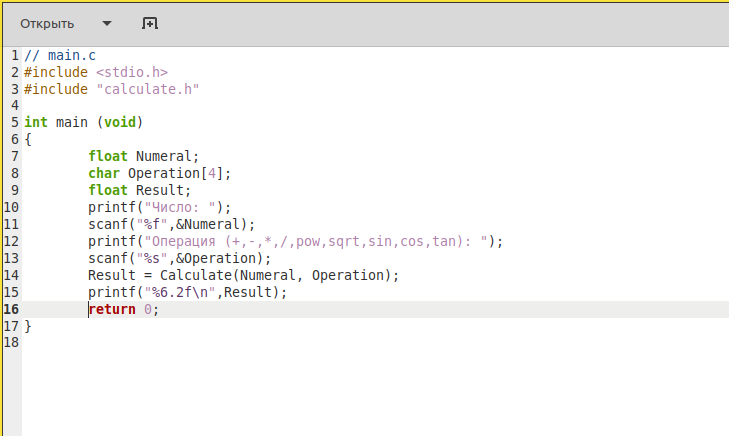
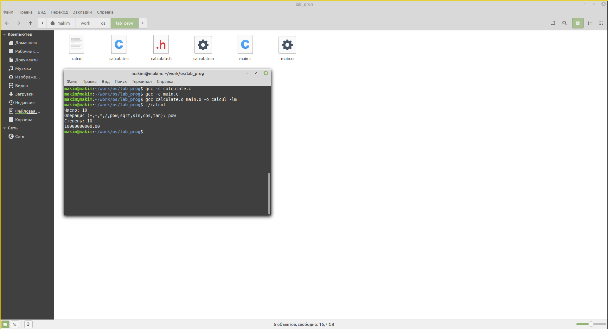
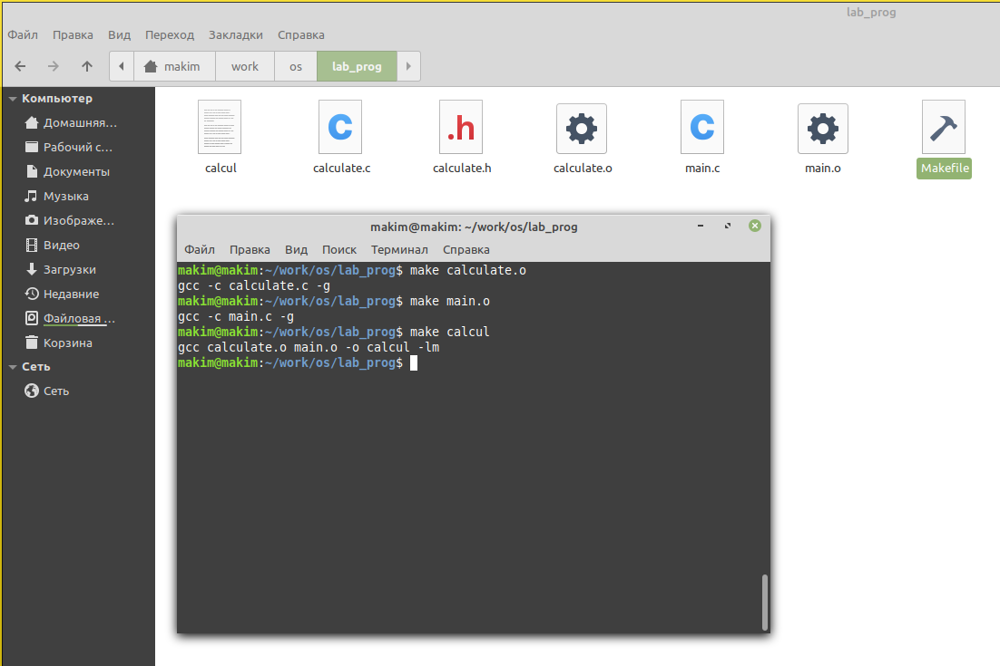
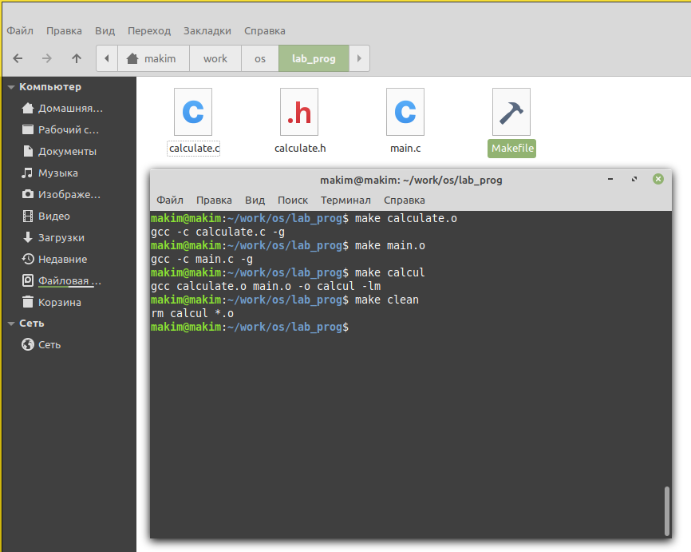
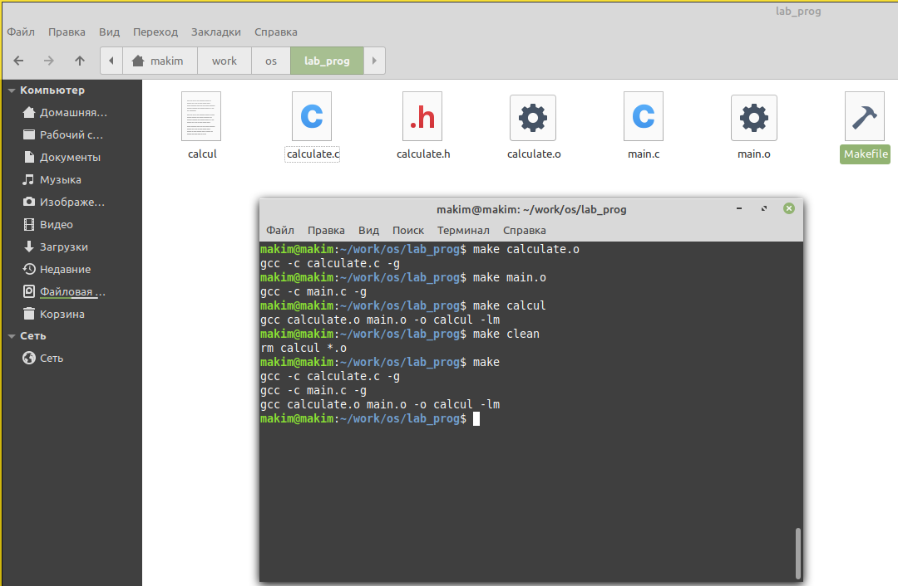
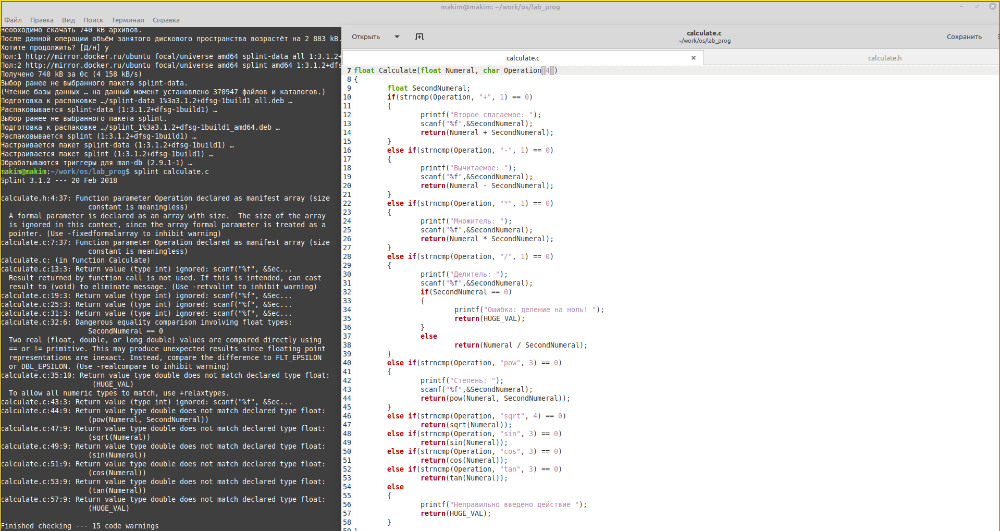

---
# Front matter
title: "Лабораторная работа №14"
subtitle: "Средства, применяемые при разработке программного обеспечения в ОС типа UNIX/Linux"
author: "Ким Михаил Алексеевич"

# Generic otions
lang: ru-RU
toc-title: "Содержание"

# Bibliography
bibliography: bib/cite.bib
csl: pandoc/csl/gost-r-7-0-5-2008-numeric.csl

# Pdf output format
toc: true # Table of contents
toc_depth: 2
lof: false # List of figures
lot: false # List of tables
fontsize: 12pt
linestretch: 1.5
papersize: a4
documentclass: scrreprt
## I18n
polyglossia-lang:
  name: russian
  options:
	- spelling=modern
	- babelshorthands=true
polyglossia-otherlangs:
  name: english
### Fonts
mainfont: PT Serif
romanfont: PT Serif
sansfont: PT Sans
monofont: PT Mono
mainfontoptions: Ligatures=TeX
romanfontoptions: Ligatures=TeX
sansfontoptions: Ligatures=TeX,Scale=MatchLowercase
monofontoptions: Scale=MatchLowercase,Scale=0.9
## Biblatex
biblatex: true
biblio-style: "gost-numeric"
biblatexoptions:
  - parentracker=true
  - backend=biber
  - hyperref=auto
  - language=auto
  - autolang=other*
  - citestyle=gost-numeric
## Misc options
indent: true
header-includes:
  - \linepenalty=10 # the penalty added to the badness of each line within a paragraph (no associated penalty node) Increasing the value makes tex try to have fewer lines in the paragraph.
  - \interlinepenalty=0 # value of the penalty (node) added after each line of a paragraph.
  - \hyphenpenalty=50 # the penalty for line breaking at an automatically inserted hyphen
  - \exhyphenpenalty=50 # the penalty for line breaking at an explicit hyphen
  - \binoppenalty=700 # the penalty for breaking a line at a binary operator
  - \relpenalty=500 # the penalty for breaking a line at a relation
  - \clubpenalty=150 # extra penalty for breaking after first line of a paragraph
  - \widowpenalty=150 # extra penalty for breaking before last line of a paragraph
  - \displaywidowpenalty=50 # extra penalty for breaking before last line before a display math
  - \brokenpenalty=100 # extra penalty for page breaking after a hyphenated line
  - \predisplaypenalty=10000 # penalty for breaking before a display
  - \postdisplaypenalty=0 # penalty for breaking after a display
  - \floatingpenalty = 20000 # penalty for splitting an insertion (can only be split footnote in standard LaTeX)
  - \raggedbottom # or \flushbottom
  - \usepackage{float} # keep figures where there are in the text
  - \floatplacement{figure}{H} # keep figures where there are in the text
---

# Цель работы

Приобрести простейшие навыки разработки, анализа, тестирования и отладки приложений в ОС типа UNIX/Linux на примере создания на языке программирования С калькулятора с простейшими функциями.

# Выполнение лабораторной работы.

1. В домашнем каталоге создаём подкаталог ~/work/os/lab_prog. (рис. 2.1)

    ```
    mkdir -p ~/work/os/lab_prog
    /либо/
    mkdir work/os
    mkdir work/os/lab_prog
    ```

2. Создайте в нём файлы: calculate.h, calculate.c, main.c. Это будет примитивнейший калькулятор, способный складывать, вычитать, умножать и делить, возводить число в степень, брать квадратный корень, вычислять sin, cos, tan. При запуске он будет запрашивать первое число, операцию, второе число. После этого программа выведет результат и остановится. (рис. 2.1)

    ```
    cd ~/work/os/lab_prog
    touch calculate.h calculate.c main.c
    ```

   


3. Реализуем функций калькулятора в файле calculate.c. (рис. 2.2)

    ```
    // calculate.c

    // подключаем необходимые библиотеки и заголовчный файл
    #include <stdio.h> 
    #include <math.h>
    #include <string.h>
    #include "calculate.h"

    // объявляем функцию типа float, 
    // которая будет возвращать результат вычисления
    // функция принимает значение float (первое число)
    // и массив char (операция)
    float Calculate(float Numeral,char Operation[4])
    {
        // создаем переменную типа float,
        // в котором будет храниться второе число
        float SecondNumeral;

        // используем ветвеления, чтобы определить операцию
        // strncmp – сравнение строк с ограничением количества сравниваемых символов
        // strncmp(const char *str1, const char *str2, size_t n)
        // str1, str2 – указатели на сравниваемые строки.
        // size_t n – количество символов для сравнения.
        // Возвращаемое значение: 0 – если первые n символов сравниваемых строк идентичны.

        // в зависимости от операции, мы попадаем в одно из втевлений и возвращаем результат операции с помощью return
        // если необходимо просим ввести второе число

        // по такому принципу пишется все нижеперечисленное

        if (strncmp(Operation, "+", 1) == 0)
        {
            printf("Второе слагаемое: ");
            scanf("%f", &SecondNumeral);
            return (Numeral + SecondNumeral);
        }
        else if (strncmp(Operation,"-",1) == 0)
        {
            printf("Вычитаемое: ");
            scanf("%f",&SecondNumeral);
            return (Numeral - SecondNumeral);
        }
        else if (strncmp(Operation,"*",1) == 0)
        {
            printf("Множитель: ");
            scanf("%f",&SecondNumeral);
            return (Numeral * SecondNumeral);
        }
        else if (strncmp(Operation,"/",1) == 0)
        {
            printf("Делитель: ");
            scanf("%f",&SecondNumeral);
            if (SecondNumeral == 0)
            {
                printf("Ошибка: деление на ноль! ");
                return(HUGE_VAL);
            }
            else
                return (Numeral / SecondNumeral);
        }
        else if (strncmp(Operation,"pow",3) == 0)
        {
            printf("Степень: ");
            scanf("%f",&SecondNumeral);
            return (pow(Numeral, SecondNumeral));
        }
        else if (strncmp(Operation,"sqrt",4) == 0)
            return (sqrt(Numeral));
        else if (strncmp(Operation,"sin",3) == 0)
            return (sin(Numeral));
        else if(strncmp(Operation,"cos",3)==0)
            return (cos(Numeral));
        else if(strncmp(Operation,"tan",3)==0)
            return(tan(Numeral));
        else 
        {
            printf("Неправильно введено действие ");
            return(HUGE_VAL);
        }
    }

    ```

    

4. Реализуем заголовочный файл calculate.h, описывающий формат вызова функции калькулятора. (рис. 2.3)

    ```
    // calculate.h

    // Директива #ifndef проверяет, определено ли имя CALCULATE_H_,
    // если нет, то управление передаётся директиве #define 
    // и определяется интерфейс класса. Если же имя CALCULATE_H_ 
    // уже определено, управление передаётся директиве #endif. 
    // Таким образом, исключается возможность многократного 
    // определения класса CALCULATE_H_.

    #ifndef CALCULATE_H_   
    #define CALCULATE_H_

    float Calculate(float Numeral, char Operation[4]);

    #endif/*CALCULATE_H_*/

    ```

    


5. Пишем основной файл main.c, реализующий интерфейс пользователя к калькулятору. (рис. 2.4)

    ```
    // main.c

    // подключаем библиотеки
    #include <stdio.h>
    #include "calculate.h"

    int main (void){
        // объявляем переменную, хранящую первое число
        float Numeral;

        // объявляем массив, где будет храниться операция
        char Operation[4];

        // объявляем переменную, где будет храниться результат
        float Result;

        // просим ввести и принимаем первое число
        printf("Число: ");
        scanf("%f",&Numeral);

        // просим ввести и принимаем операцию
        printf("Операция (+,-,*,/,pow,sqrt,sin,cos,tan): ");
        scanf("%s",&Operation[0]);

        // записываем в Result возвращенное значение из Calculate
        Result = Calculate(Numeral, Operation);

        // выводим результат
        printf("%6.2f\n",Result);

        return 0;
    }

    ```

    


6. Выполняем компиляцию программы посредством gcc и проверяем работу калькулятора. (рис. 2.5)

    ```
    gcc -c calculate.c
    gcc -c main.c
    gcc calculate.o main.o -o calcul -lm
    ```

    

7. Создаём Makefile. Для создания изпользуем образец из работы. Попутно исправляем ошибки в образце, которые препятсвуют оптимальной работе отладчика. (рис. 2.6)

    ```
    #
    # Makefile
    #

    CC = gcc
    CFLAGS =
    LIBS = -lm

    // цель calcul - отвечает за создание исполняемого файла calcul
    // на основе calculate.o main.o (зависит от этих файлов)
    calcul: calculate.o main.o
        gcc calculate.o main.o -o calcul $(LIBS)

    // calculate.o - отвечает за создание объектного файла calculate.o
    // на основе calculate.c
    // не забываем добавить опцию -g, чтобы отладочная информация содержалась в результирующем бинарном файле. 
    calculate.o: calculate.c calculate.h 
        gcc -c calculate.c -g $(CFLAGS)

    // main.o - отвечает за создание объектного файла main.o
    // на основе main.c
    // не забываем добавить опцию -g, чтобы отладочная информация содержалась в результирующем бинарном файле.
    main.o: main.c calculate.h
        gcc -c main.c -g $(CFLAGS)

    // clean отвечает за удаление объектных файлов и самого исполняемого файла
    clean:
        -rm calcul *.o
    ```

    


8. Используем Makefile. (рис. 2.7-2.9)

    ```
    Компиляция по-отдельности:
    make calculate.o
    make main.o
    make calcul

    Полная компиляция сразу:
    make 
    ```

    

    

    

9. Запускаем отладчик GDB, загрузив в него программу для отладки. (рис. 2.10)

    ```
    gdb ./calcul
    ```

10. Для запуска программы внутри отладчика вводим команду run. (рис. 2.10)

    ```
    run
    ```

11. Для постраничного (по 9 строк) просмотра исходного код используем команду list. (рис. 2.10)

    ```
    list
    ```

12. Для просмотра строк с 12 по 15 основного файла используем list с параметрами. (рис. 2.10)

    ```
    list 12,15
    ```

13. Для просмотра определённых строк не основного файла используем list с параметрами. (рис. 2.10)

    ```
    list calculate.c:20,29
    ```

   

14. Устанавливаем точку остановки в файле calculate.c на строке номер 22, чтобы программа остановилась, после ввода операции вычетания. (рис. 2.11)

    ```
    list calculate.c:15,25
    break 18
    ```

15. Выводим информацию об имеющихся в проекте точка останова.  (рис. 2.11)

    ```
    info breakpoints
    ```

16. Запускаем программу внутри отладчика и убеждаемся, что программа остановилась в момент прохождения точки остановки. (рис. 2.11)

    ```
    run
    5
    -
    ```

17. Используем команду backtrace, которая показывает весь стек вызываемых функций от начала программы до текущего места. (рис. 2.11)

    ```
    backtrace
    ```

18. Просматриваем, чему равно на этом этапе значение переменной Numeral. (рис. 2.11)

    ```
    print Numeral
    ```

19. Сравниваем с результатом вывода на экран после использования команды display. (рис. 2.11)

    ```
    display Numeral
    ```

20. Убераем точки остановки. (рис. 2.11)

    ```
    info breakpoints
    delete 2
    ```

    

21. С помощью утилиты splint пробуем проанализировать коды файлов calculate.c и main.c. Найдены незначительные ошибки, невлияющие на работоспособность кода. Например, утилита предлагает посылать не весь массив Operation в функцию Calculate, а только указатель на него. Это не является ошибкой, но оптимизурет код. Также splint предупреждает, что опасно однозначно сравнивать числа с плавующей точкой и целочисленные числа, опять же хорошоее замечание, но на работу сильно не влияет. В общем, splint не нашел серьёзных ошибок, что, в целом, логично, поскольку код работает. (рис. 2.12 - 2.14)

    ```
    splint calculate.c
    splint main.c
    ```

   

   

   

# Выводы

Мы приобрели простейшие навыки разработки, анализа, тестирования и отладки приложений в ОС типа UNIX/Linux. Закрепили знания, полученные в прошлых работах. Создали на языке программирования С калькулятор с простейшими функциями и разобрали на нем основные навыки отладки.

# Термины

* GCC (GNU Compiler Collection) - этото набор компиляторов для разного рода языков программирования (С, C++, Java, Фортран и др.).

*  GDB (GNU Debugger) - отладчик для поиска и устранения ошибок в программе. Входит в комплект программ GNU для ОС типа UNIX.

*  Утилита make позволяет автоматизировать процесс преобразования файлов программы из одной формы в другую, отслеживает взаимосвязи
между файлами.

* Утилита splint анализирует программный код, проверяет корректность задания аргументов использованных в программе функций и типов возвращаемых значений, обнаруживает синтаксические и семантические ошибки.

* Командный процессор (командная оболочка, интерпретатор команд shell) — это программа, позволяющая пользователю взаимодействовать с операционной системой компьютера.

* POSIX (Portable Operating System Interface for Computer Environments) — набор стандартов описания интерфейсов взаимодействия операционной системы и прикладных программ.

* Последовательность команд может быть помещена в текстовый файл. Такой файл называется командным.

* Каталог, он же директория, (от англисйкого Directory) – это объект в ФС (файловой системе), необходимый для того, чтобы упросить работу с файлами.

* Домашний каталог - каталог, предназначенный для хранения собственных данных пользователя Linux. Как правило, является текущим непосредственно после регистрации пользователя в системе.

* Команда - записанный по специальным правилам текст (возможно с аргументами), представляющий собой указание на выполнение какой-либо функций (или действий) в операционной системе.