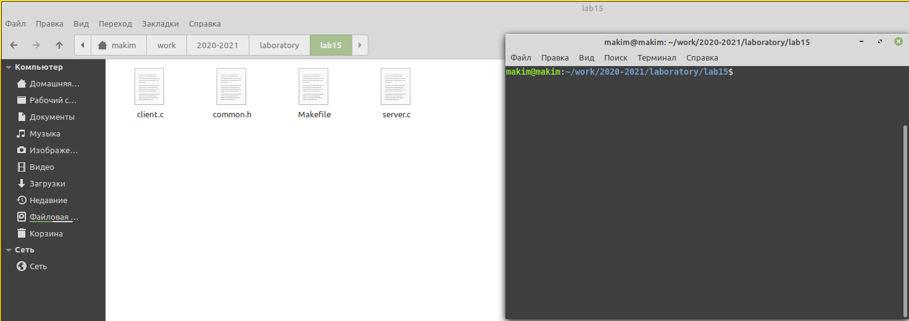
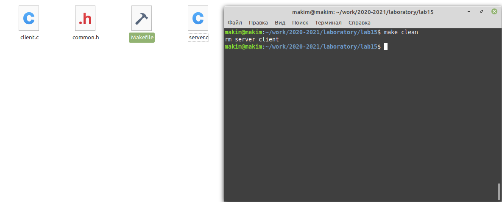
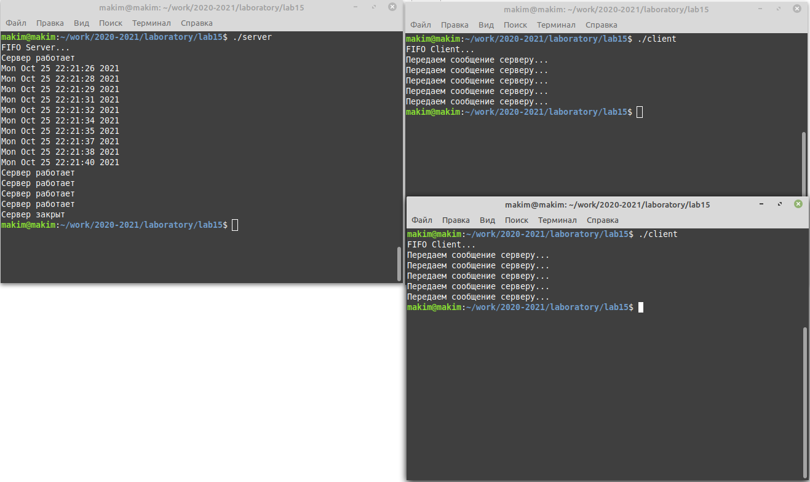

---
# Front matter
title: "Лабораторная работа №15"
subtitle: "Именованные каналы"
author: "Ким Михаил Алексеевич"

# Generic otions
lang: ru-RU
toc-title: "Содержание"

# Bibliography
bibliography: bib/cite.bib
csl: pandoc/csl/gost-r-7-0-5-2008-numeric.csl

# Pdf output format
toc: true # Table of contents
toc_depth: 2
lof: false # List of figures
lot: false # List of tables
fontsize: 12pt
linestretch: 1.5
papersize: a4
documentclass: scrreprt
## I18n
polyglossia-lang:
  name: russian
  options:
	- spelling=modern
	- babelshorthands=true
polyglossia-otherlangs:
  name: english
### Fonts
mainfont: PT Serif
romanfont: PT Serif
sansfont: PT Sans
monofont: PT Mono
mainfontoptions: Ligatures=TeX
romanfontoptions: Ligatures=TeX
sansfontoptions: Ligatures=TeX,Scale=MatchLowercase
monofontoptions: Scale=MatchLowercase,Scale=0.9
## Biblatex
biblatex: true
biblio-style: "gost-numeric"
biblatexoptions:
  - parentracker=true
  - backend=biber
  - hyperref=auto
  - language=auto
  - autolang=other*
  - citestyle=gost-numeric
## Misc options
indent: true
header-includes:
  - \linepenalty=10 # the penalty added to the badness of each line within a paragraph (no associated penalty node) Increasing the value makes tex try to have fewer lines in the paragraph.
  - \interlinepenalty=0 # value of the penalty (node) added after each line of a paragraph.
  - \hyphenpenalty=50 # the penalty for line breaking at an automatically inserted hyphen
  - \exhyphenpenalty=50 # the penalty for line breaking at an explicit hyphen
  - \binoppenalty=700 # the penalty for breaking a line at a binary operator
  - \relpenalty=500 # the penalty for breaking a line at a relation
  - \clubpenalty=150 # extra penalty for breaking after first line of a paragraph
  - \widowpenalty=150 # extra penalty for breaking before last line of a paragraph
  - \displaywidowpenalty=50 # extra penalty for breaking before last line before a display math
  - \brokenpenalty=100 # extra penalty for page breaking after a hyphenated line
  - \predisplaypenalty=10000 # penalty for breaking before a display
  - \postdisplaypenalty=0 # penalty for breaking after a display
  - \floatingpenalty = 20000 # penalty for splitting an insertion (can only be split footnote in standard LaTeX)
  - \raggedbottom # or \flushbottom
  - \usepackage{float} # keep figures where there are in the text
  - \floatplacement{figure}{H} # keep figures where there are in the text
---

# Цель работы

Приобретение практических навыков работы с именованными каналами.

# Выполнение лабораторной работы.

1. В домашнем каталоге создаём подкаталог ~/work. (рис. 2.1)

    ```
    mkdir work
    ```

2. Создаём в нём файлы: common.h, server.c, client.c, Makefile. (рис. 2.1)

    ```
    cd work
    touch common.h server.c client.c Makefile
    ```

    


3. Нам необходимо написать программу на основе кода из примера. Программа должна работать с несколькими клиентами. Клиенты передают текущее время с некоторой периодичностью (например, раз в пять секунд). Сервер работает не бесконечно, а прекращает работу через некоторое время (например, 30 сек). Напишем заголовочный файл. Кроме библиотек из примера, добавляем библиотеку для работы со временем. (рис. 2.2)

    ```
    
    // common.h - заголовочный файл со стандартными определениями*

    #ifndef __COMMON_H__
    #define __COMMON_H__

    #include <stdio.h>
    #include <stdlib.h>
    #include <string.h>
    #include <errno.h>
    #include <sys/types.h>
    #include <sys/stat.h>
    #include <fcntl.h>

    // добавляем библиотеку для работы со временем
    #include <time.h> 

    #define FIFO_NAME "/tmp/fifo"
    #define MAX_BUFF 80

    #endif 
    /* __COMMON_H__ */
    ```

    


4. Пишем файл client.c. В коде зацикливаем запись в файл FIFO. В каждом цикле записываем в переменную время, переводим эту переменную в строку и отправляем на сервер. (рис. 2.3)

    ```
    // client.c - реализация клиента

    #include "common.h"
    #define MESSAGE "Hello Server!!!\n"

    int main()
    {
        int writefd;	/* дескриптор для записи в FIFO */
        int msglen;
        
        printf("FIFO Client...\n");	/* баннер */
        
        if((writefd = open(FIFO_NAME, O_WRONLY)) < 0)	/* получим доступ к FIFO */
        {
            fprintf(stderr, "%s: Невозможно открыть FIFO (%s)\n",
            __FILE__, strerror(errno));
            exit(-1);
        }
        
        /* передадим сообщение серверу */
        // Цикл for для передачи некольких сообщений
        for (int i = 0; i < 5; i++)
        {
            printf("Передаем сообщение серверу...\n");

            // переменная для хранения текущего времени
            const time_t ttime = time(NULL);

            // сохраняем в msglen длинну времени, приводя его к адекватному виду
            msglen = strlen(ctime (&ttime));
            if(write(writefd, ctime (&ttime), msglen) != msglen)
            {
                fprintf(stderr, "%s: Ошибка записи в FIFO (%s)\n",
                __FILE__, strerror(errno));
                exit(-2);
            }
            sleep(3);
        }
        
        /* закроем доступ к FIFO */
        close(writefd);
        exit(0);
    }
    ```

    

5. Реализуем файл server.c. Создаем переменную, которая хранит время начала запуска программы. Производим чтение файла FIFO, пока не истекли 30 секунд. (рис. 2.4)

    ```
    // server.c

    #include "common.h"

    int main()
    {
        int readfd; /* дескриптор для чтения из FIFO */
        int n;
        char buff[MAX_BUFF]; /* буфер для чтения данных из FIFO */
        
        /* баннер */
        printf("FIFO Server...\n");
        
        /* создаем файл FIFO с открытыми для всех правами доступа на чтение и запись */
        if(mknod(FIFO_NAME, S_IFIFO | 0666, 0) < 0)
        {
            fprintf(stderr, "%s: Невозможно создать FIFO (%s)\n",
            __FILE__, strerror(errno));
            exit(-1);
            }
            
        /* откроем FIFO на чтение */
        if((readfd = open(FIFO_NAME, O_RDONLY)) < 0)
        {
            fprintf(stderr, "%s: Невозможно открыть FIFO (%s)\n",
            __FILE__, strerror(errno));
            exit(-2);
        }

        // создаём константу, где будет храниться время начала работы программы
        const time_t start = time(NULL);

        // пока не прошло 30 секунд, сервер будет "принимать сообщения"
        while (time(NULL) - start < 30)
        {
            printf("Сервер работает\n");
            /* читаем данные из FIFO и выводим на экран */
            while((n = read(readfd, buff, MAX_BUFF)) > 0)
            {
                if(write(1, buff, n) != n)
                {
                    fprintf(stderr, "%s: Ошибка вывода (%s)\n",
                    __FILE__, strerror(errno));
                    exit(-3);
                }
            }
            sleep(3);
        }
        
        close(readfd); /* закроем FIFO */
        printf("Сервер закрыт\n");
        
        /* удалим FIFO из системы */
        if(unlink(FIFO_NAME) < 0)
        {
            fprintf(stderr, "%s: Невозможно удалить FIFO (%s)\n",
            __FILE__, strerror(errno));
            exit(-4);
        }
        
        exit(0);
    }
    ```

   

6. Создаём Makefile и компилируем программу. (рис. 2.5, 2.6)

    ```
    all: server client

    server: server.c common.h
        gcc server.c -o server

    client: client.c common.h
        gcc client.c -o client
        
    clean:
        -rm server client 
    ```

    

    ```
    make 
    ```

    


7. Наблюдаем процесс работы. (рис. 2.7)

   

# Выводы

Мы приобрели практические навыки работы с именованными каналами. Реализовали программу для обмена сообщениями.

# Термины

* Сообщение - последовательность байтов, передаваемая от одного процесса другому.

* Named pipes - механизм именованных каналов для передачи данных между неродственными процессами.

* FIFO - принцип передачи данных: First In First Out (первым записан — первым прочитан).

* GCC (GNU Compiler Collection) - этото набор компиляторов для разного рода языков программирования (С, C++, Java, Фортран и др.).

* Утилита make позволяет автоматизировать процесс преобразования файлов программы из одной формы в другую, отслеживает взаимосвязи
между файлами.

* Командный процессор (командная оболочка, интерпретатор команд shell) — это программа, позволяющая пользователю взаимодействовать с операционной системой компьютера.

* Последовательность команд может быть помещена в текстовый файл. Такой файл называется командным.

* Каталог, он же директория, (от англисйкого Directory) – это объект в ФС (файловой системе), необходимый для того, чтобы упросить работу с файлами.

* Домашний каталог - каталог, предназначенный для хранения собственных данных пользователя Linux. Как правило, является текущим непосредственно после регистрации пользователя в системе.

* Команда - записанный по специальным правилам текст (возможно с аргументами), представляющий собой указание на выполнение какой-либо функций (или действий) в операционной системе.